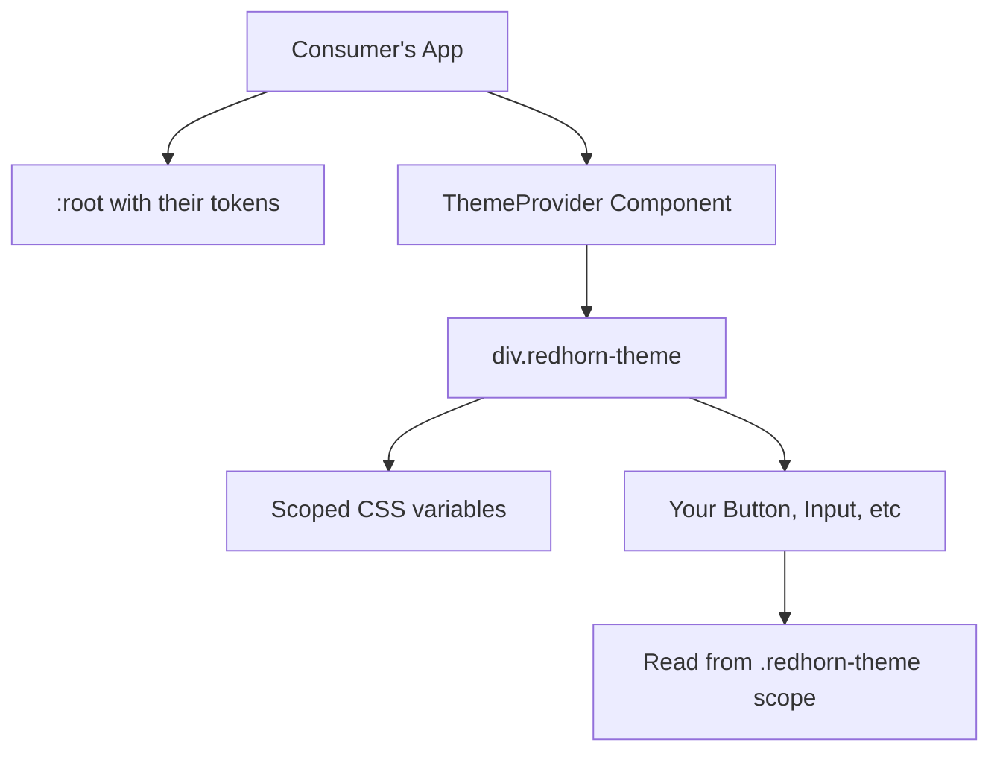

# CSS Import Safety Guide for NPM Packages

## Table of Contents
1. [The Problem](#the-problem)
2. [Common Issues & Solutions](#common-issues--solutions)
3. [Implementation Strategy](#implementation-strategy)
4. [Step-by-Step Guide](#step-by-step-guide)
5. [Testing Guide](#testing-guide)
6. [Real-World Examples](#real-world-examples)

---

## The Problem

When you publish a design system as an npm package, your CSS can break the consumer's application in multiple ways:

### Problem 1: Global Style Conflicts
```css
/* Your library's CSS */
:root {
  --color-primary: #eb0a1e;
}

input {
  padding: 8px;
  border-radius: 4px;
}
```

```css
/* Consumer's CSS */
:root {
  --color-primary: #blue; /* ❌ Your library overrides this */
}

input {
  padding: 12px; /* ❌ Your library overrides this */
}
```

**Result:** Consumer's forms look broken because your library's styles take precedence.

### Problem 2: CSS Variable Collisions
If both you and the consumer use the same CSS variable names, one will override the other unpredictably.

### Problem 3: Import Order Dependency
```tsx
// Order matters = fragile
import '@company/design-system/styles.css'; // Loaded first
import './app.css'; // Loaded second - might not override properly
```

---

## Common Issues & Solutions

### Issue 1: Relative Path Imports Break

**Problem:**
```css
/* Your library source */
@import '../../../tokens/dist/css/light.css';
/* This path doesn't exist in consumer's node_modules! */
```

**Solution:**
Bundle/inline all imports during build so the final CSS has no `@import` statements.

```javascript
// Vite plugin (already in your config)
{
  name: 'bundle-css',
  writeBundle() {
    const lightCss = readFileSync('../tokens/dist/css/light.css');
    globalCss = globalCss.replace(/@import.*light\.css/, lightCss);
  }
}
```

---

### Issue 2: CSS Modules Not Compiled

**Problem:**
You ship `.module.css` source files, but consumer's bundler doesn't process files from `node_modules`.

**Solution:**
Pre-compile CSS Modules before publishing. Vite does this automatically:

```
Input:  .button { color: red; }
Output: .Button_button__a1b2c3 { color: red; }
```

---

### Issue 3: Global Selectors Override Consumer Styles

**Problem:**
```css
/* Your library */
* { box-sizing: border-box; }
body { margin: 0; }
input { border: 1px solid gray; }
```

**Solution:**
NEVER use global selectors. Use component-scoped resets:

```css
/* ✅ Scoped to your component */
.button {
  box-sizing: border-box;
  margin: 0;
  padding: 0;
}
```

---

### Issue 4: CSS Variable Name Collisions

**Problem:**
```css
/* Your library */
:root { --color-primary: red; }

/* Consumer's app */
:root { --color-primary: blue; }

/* Both can't coexist on :root! */
```

**Solution:**
Scope variables to a class instead of `:root`:

```css
/* ✅ Your library - scoped */
.redhorn-theme[data-theme="light"] {
  --color-primary: red;
}

/* ✅ Consumer's app - global */
:root {
  --color-primary: blue;
}

/* No collision! Different scopes */
```

---

### Issue 5: Build Tool Differences

Different bundlers handle CSS differently:
- **Webpack**: Might exclude node_modules CSS by default
- **Vite**: Fast but different CSS handling
- **Next.js**: Requires specific import locations
- **Create React App**: Older versions can't import CSS from node_modules

**Solution:**
Ship pre-bundled, standard CSS that works everywhere:
```
dist/
├── index.css       ← Vanilla CSS, no fancy features
├── index.esm.js
└── index.cjs.js
```

---

## Implementation Strategy

### The Solution: Scoped Theme Provider

This is what Material-UI, Chakra UI, Radix, and other major design systems use.

**How it works:**



**Example:**

```tsx
// Consumer's app
import { ThemeProvider, Button } from '@redhorn/react-ui';
import '@redhorn/react-ui/styles';

function App() {
  return (
    <div>
      {/* Their own HTML - unaffected */}
      <input placeholder="Their input" />
      
      {/* Your design system - scoped */}
      <ThemeProvider scoped>
        <Button>Your button</Button>
      </ThemeProvider>
    </div>
  );
}
```

**Generated HTML:**
```html
<div>
  <input placeholder="Their input" />
  
  <div class="redhorn-theme" data-theme="light">
    <button class="Button_button__a1b2c3">Your button</button>
  </div>
</div>
```

**CSS:**
```css
/* Your tokens - scoped to .redhorn-theme */
.redhorn-theme[data-theme="light"] {
  --color-primary: #eb0a1e;
  --color-text: #000;
}

/* Your component - CSS Module */
.Button_button__a1b2c3 {
  background: var(--color-primary);
  color: var(--color-text);
}
```

**Why this works:**
1. CSS variables inherit from parent `.redhorn-theme` div
2. Only your components inside ThemeProvider use these variables
3. Consumer's `:root` variables are completely separate
4. No collisions possible!

---

## Step-by-Step Guide

### Step 1: Create Scoped CSS Format

Create a custom Style Dictionary format that outputs scoped CSS instead of `:root`.

**File:** `config/formats/scoped-css.js`

```javascript
module.exports = {
  name: 'css/scoped',
  formatter: ({ dictionary, options }) => {
    const selector = options.selector || '.redhorn-theme';
    const theme = options.theme || 'light';
    
    const tokens = dictionary.allTokens
      .map(token => `  ${token.name}: ${token.value};`)
      .join('\n');
    
    return `/**
 * Do not edit directly, this file was auto-generated.
 */

${selector}[data-theme="${theme}"] {
${tokens}
}`;
  }
};
```

**What this does:**
- Takes your tokens
- Wraps them in `.redhorn-theme[data-theme="light"]` instead of `:root`
- Generates scoped CSS variables

---

### Step 2: Update Style Dictionary Config

**File:** `config/style-dictionary.config.js`

```javascript
const scopedFormat = require('./formats/scoped-css');

module.exports = {
  // Register custom format
  format: {
    'css/scoped': scopedFormat
  },
  
  source: ['packages/tokens/**/*.json'],
  
  platforms: {
    css: {
      transformGroup: 'css',
      buildPath: 'packages/tokens/dist/css/',
      files: [
        // Light theme - scoped
        {
          destination: 'light-scoped.css',
          format: 'css/scoped',
          options: {
            selector: '.redhorn-theme',
            theme: 'light'
          }
        },
        // Dark theme - scoped
        {
          destination: 'dark-scoped.css',
          format: 'css/scoped',
          options: {
            selector: '.redhorn-theme',
            theme: 'dark'
          }
        },
        // Legacy global versions (for backward compatibility)
        {
          destination: 'light.css',
          format: 'css/variables'
        },
        {
          destination: 'dark.css',
          format: 'css/variables'
        }
      ]
    }
  }
};
```

**Run to generate:**
```bash
npm run build:tokens
```

**Output:**
```
packages/tokens/dist/css/
├── light-scoped.css    ← NEW: Scoped tokens
├── dark-scoped.css     ← NEW: Scoped tokens
├── light.css           ← Legacy global
└── dark.css            ← Legacy global
```

---

### Step 3: Create ThemeProvider Component

**File:** `packages/react-ui/src/components/ThemeProvider/ThemeProvider.tsx`

```typescript
import React, { createContext, useContext, useEffect, useState } from 'react';

interface ThemeContextValue {
  theme: 'light' | 'dark';
  setTheme: (theme: 'light' | 'dark') => void;
  toggleTheme: () => void;
}

const ThemeContext = createContext<ThemeContextValue | undefined>(undefined);

export interface ThemeProviderProps {
  /** Children components */
  children: React.ReactNode;
  /** Initial theme (defaults to light) */
  defaultTheme?: 'light' | 'dark';
  /** Enable scoped mode (recommended for library usage) */
  scoped?: boolean;
  /** Custom class name */
  className?: string;
}

/**
 * Theme Provider Component
 * 
 * Provides theme context and scoped CSS variables to child components.
 * 
 * @example
 * ```tsx
 * <ThemeProvider scoped>
 *   <Button>Click me</Button>
 * </ThemeProvider>
 * ```
 */
export const ThemeProvider: React.FC<ThemeProviderProps> = ({
  children,
  defaultTheme = 'light',
  scoped = true,
  className = '',
}) => {
  const [theme, setTheme] = useState<'light' | 'dark'>(() => {
    // SSR-safe initialization
    if (typeof window === 'undefined') return defaultTheme;
    
    // Check localStorage
    const stored = localStorage.getItem('redhorn-theme');
    if (stored === 'light' || stored === 'dark') return stored;
    
    // Check system preference
    if (window.matchMedia?.('(prefers-color-scheme: dark)').matches) {
      return 'dark';
    }
    
    return defaultTheme;
  });

  const toggleTheme = () => {
    setTheme(prev => prev === 'light' ? 'dark' : 'light');
  };

  // Persist theme changes
  useEffect(() => {
    if (typeof window !== 'undefined') {
      localStorage.setItem('redhorn-theme', theme);
      
      // Set on document for global mode
      if (!scoped) {
        document.documentElement.setAttribute('data-theme', theme);
      }
    }
  }, [theme, scoped]);

  const containerClass = [
    scoped ? 'redhorn-theme' : '',
    className
  ].filter(Boolean).join(' ');

  const value: ThemeContextValue = {
    theme,
    setTheme,
    toggleTheme,
  };

  return (
    <ThemeContext.Provider value={value}>
      {scoped ? (
        <div className={containerClass} data-theme={theme}>
          {children}
        </div>
      ) : (
        <>{children}</>
      )}
    </ThemeContext.Provider>
  );
};

/**
 * Hook to access theme context
 * 
 * @example
 * ```tsx
 * const { theme, setTheme, toggleTheme } = useTheme();
 * ```
 */
export const useTheme = (): ThemeContextValue => {
  const context = useContext(ThemeContext);
  
  if (context === undefined) {
    throw new Error('useTheme must be used within a ThemeProvider');
  }
  
  return context;
};

ThemeProvider.displayName = 'ThemeProvider';
```

**File:** `packages/react-ui/src/components/ThemeProvider/index.ts`

```typescript
export { ThemeProvider, useTheme } from './ThemeProvider';
export type { ThemeProviderProps } from './ThemeProvider';
```

---

### Step 4: Update Global CSS to Use Scoped Tokens

**File:** `packages/react-ui/src/styles/global.css`

```css
/* Import scoped tokens (these only apply within .redhorn-theme) */
@import '../../../tokens/dist/css/light-scoped.css';
@import '../../../tokens/dist/css/dark-scoped.css';

/* 
 * No global styles!
 * All styling is scoped to components via CSS Modules
 * and tokens are scoped to .redhorn-theme
 */
```

---

### Step 5: Export ThemeProvider

**File:** `packages/react-ui/src/components/index.js`

```javascript
export { Button } from './Button';
export { Checkbox } from './Checkbox';
export { Input } from './Input';
export { ThemeProvider, useTheme } from './ThemeProvider'; // ADD THIS
```

---

### Step 6: Add Autoprefixer

**File:** `packages/react-ui/package.json`

```json
{
  "devDependencies": {
    "autoprefixer": "^10.4.16"
  }
}
```

**File:** `packages/react-ui/vite.config.js`

```javascript
import autoprefixer from 'autoprefixer';

export default defineConfig({
  css: {
    postcss: {
      plugins: [
        autoprefixer({
          overrideBrowserslist: ['>0.2%', 'not dead', 'not op_mini all']
        })
      ]
    }
  },
  // ... rest of config
});
```

---

### Step 7: Update package.json Exports

**File:** `packages/react-ui/package.json`

```json
{
  "name": "@redhorn/react-ui",
  "version": "2.0.0",
  "main": "./dist/index.cjs.js",
  "module": "./dist/index.esm.js",
  "types": "./dist/index.d.ts",
  "exports": {
    ".": {
      "import": "./dist/index.esm.js",
      "require": "./dist/index.cjs.js",
      "types": "./dist/index.d.ts"
    },
    "./styles": "./dist/index.css",
    "./dist/index.css": "./dist/index.css"
  },
  "files": [
    "dist",
    "README.md"
  ]
}
```

---

### Step 8: Build Everything

```bash
# 1. Install new dependencies
cd packages/react-ui
npm install

# 2. Build tokens (with new scoped format)
cd ../..
npm run build:tokens

# 3. Build React UI package
npm run build

# 4. Verify output
ls packages/react-ui/dist
# Should see: index.css, index.esm.js, index.cjs.js, index.d.ts
```

---

## Testing Guide

### Test 1: Local Package Test

```bash
# Create a test package
cd packages/react-ui
npm pack
# Creates: redhorn-react-ui-2.0.0.tgz

# Install in test app
cd ../../
npm create vite@latest test-app -- --template react-ts
cd test-app
npm install
npm install ../packages/react-ui/redhorn-react-ui-2.0.0.tgz
```

**Test app:** `test-app/src/App.tsx`

```tsx
import { ThemeProvider, Button, Input } from '@redhorn/react-ui';
import '@redhorn/react-ui/styles';
import './App.css';

function App() {
  return (
    <div>
      <h1>Test App</h1>
      
      {/* Native HTML - should keep its styles */}
      <input placeholder="Native input" />
      <button>Native button</button>
      
      {/* Your library - scoped */}
      <ThemeProvider scoped>
        <Button variant="primary">Library Button</Button>
        <Input label="Library Input" />
      </ThemeProvider>
    </div>
  );
}

export default App;
```

**Test app CSS:** `test-app/src/App.css`

```css
/* Conflicting styles to test isolation */
:root {
  --color-primary: blue !important;
}

input {
  border: 5px solid red !important;
  padding: 20px !important;
}

button {
  background: green !important;
  padding: 30px !important;
}
```

**Expected result:**
- ✅ Native input/button: Red border, green background (consumer's styles)
- ✅ Library components: Design system styles (no conflicts)

---

### Test 2: Next.js Test

```bash
npx create-next-app@latest test-nextjs --typescript
cd test-nextjs
npm install ../packages/react-ui/redhorn-react-ui-2.0.0.tgz
```

**File:** `pages/_app.tsx`

```tsx
import '@redhorn/react-ui/styles';
import type { AppProps } from 'next/app';

export default function App({ Component, pageProps }: AppProps) {
  return <Component {...pageProps} />;
}
```

**File:** `pages/index.tsx`

```tsx
import { ThemeProvider, Button } from '@redhorn/react-ui';

export default function Home() {
  return (
    <ThemeProvider scoped>
      <Button>Next.js Test</Button>
    </ThemeProvider>
  );
}
```

---

### Test 3: Theme Switching Test

```tsx
import { ThemeProvider, useTheme, Button } from '@redhorn/react-ui';

function ThemeSwitcher() {
  const { theme, toggleTheme } = useTheme();
  
  return (
    <div>
      <p>Current theme: {theme}</p>
      <Button onClick={toggleTheme}>
        Switch to {theme === 'light' ? 'dark' : 'light'}
      </Button>
    </div>
  );
}

function App() {
  return (
    <ThemeProvider scoped>
      <ThemeSwitcher />
    </ThemeProvider>
  );
}
```

---

## Real-World Examples

### Material-UI (MUI)

```tsx
import { ThemeProvider, createTheme } from '@mui/material';

const theme = createTheme({
  palette: {
    primary: { main: '#1976d2' },
  },
});

<ThemeProvider theme={theme}>
  <Button>Click me</Button>
</ThemeProvider>
```

**How they do it:**
- CSS-in-JS (Emotion/styled-components)
- All styles scoped to component classes
- Theme via React Context
- No global CSS pollution

---

### Chakra UI

```tsx
import { ChakraProvider } from '@chakra-ui/react';

<ChakraProvider>
  <Button>Click me</Button>
</ChakraProvider>
```

**How they do it:**
- CSS variables scoped to `.chakra-ui-theme`
- Prefixed tokens: `--chakra-colors-blue-500`
- Theme provider injects scoped variables
- Utility props system

---

### Radix Themes

```tsx
import { Theme } from '@radix-ui/themes';

<Theme accentColor="blue">
  <Button>Click me</Button>
</Theme>
```

**How they do it:**
- CSS variables scoped to `.radix-themes`
- Props control CSS variable values
- Complete style isolation
- No global styles

---

## Migration Guide for Consumers

### Version 1.x (Old - Global)

```tsx
import { Button } from '@redhorn/react-ui';
import '@redhorn/react-ui/dist/index.css';

<Button>Click</Button>
```

### Version 2.x (New - Scoped)

```tsx
import { ThemeProvider, Button } from '@redhorn/react-ui';
import '@redhorn/react-ui/styles';

<ThemeProvider scoped>
  <Button>Click</Button>
</ThemeProvider>
```

### Breaking Changes

1. **ThemeProvider required** - Components must be wrapped
2. **CSS import path changed** - Use `/styles` instead of `/dist/index.css`
3. **Token selectors changed** - `:root` → `.redhorn-theme`

### Backward Compatibility

Offer both versions during migration:

```json
{
  "exports": {
    ".": "./dist/index.esm.js",
    "./styles": "./dist/index.css",
    "./legacy": "./dist/legacy.css"
  }
}
```

---

## Checklist

Before publishing to npm:

- [ ] Scoped CSS format created
- [ ] Tokens regenerated with scoped format
- [ ] ThemeProvider component created
- [ ] Global styles removed
- [ ] Autoprefixer configured
- [ ] package.json exports updated
- [ ] Build produces clean dist/ folder
- [ ] Tested in Vite app
- [ ] Tested in Next.js app
- [ ] Tested theme switching
- [ ] Tested with conflicting consumer CSS
- [ ] Documentation written
- [ ] Migration guide created
- [ ] Version bumped to 2.0.0

---

## Common Questions

### Q: Will this increase bundle size?

**A:** Minimally. The wrapper div adds ~50 bytes. Scoped CSS is same size as global CSS.

### Q: Can I use components without ThemeProvider?

**A:** No, they need the scoped CSS variables. ThemeProvider provides the scope.

### Q: What if I want global mode?

**A:** Set `scoped={false}`:
```tsx
<ThemeProvider scoped={false}>
  <Button>Uses :root tokens</Button>
</ThemeProvider>
```

### Q: Does this work with SSR?

**A:** Yes! The ThemeProvider has SSR-safe initialization.

### Q: Can I nest ThemeProviders?

**A:** Yes! Inner provider overrides outer:
```tsx
<ThemeProvider scoped>
  <Button>Light theme</Button>
  
  <ThemeProvider scoped defaultTheme="dark">
    <Button>Dark theme</Button>
  </ThemeProvider>
</ThemeProvider>
```

---

## Summary

**The scoped approach prevents CSS collisions by:**

1. ✅ **Scoping tokens** to `.redhorn-theme` instead of `:root`
2. ✅ **ThemeProvider wrapper** creates isolated scope
3. ✅ **CSS Modules** for component styles (already done)
4. ✅ **No global selectors** (already done)
5. ✅ **Pre-bundled CSS** that works everywhere

**Result:** Your design system can be safely imported into any app without breaking their styles!

---

## Next Steps

1. **Review this guide** to understand the approach
2. **Decide on implementation** (or request changes)
3. **Implement the changes** (I can do this for you)
4. **Test thoroughly** before publishing
5. **Document for consumers** with migration guide
6. **Publish to npm** as v2.0.0

---

**Questions?** Let me know if you want me to implement this for you!

