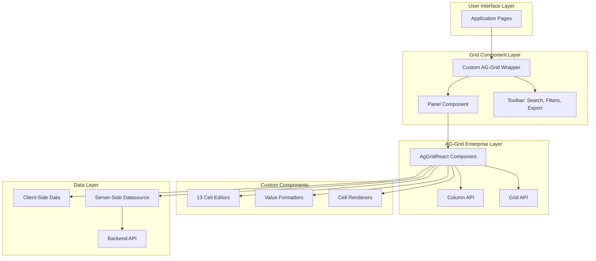
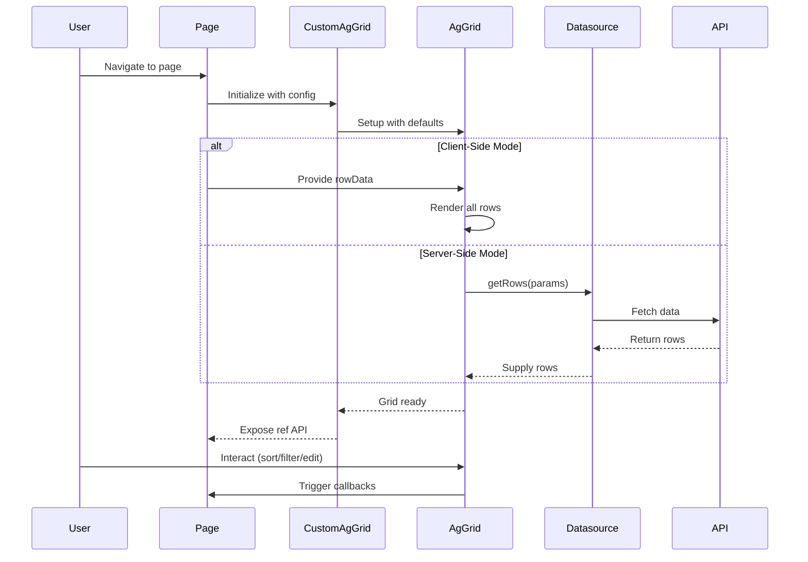

# AG-Grid Implementation Overview

## Introduction

This comprehensive ag-grid implementation, originally developed for SUDS Culture, serves as a robust foundation for data display and manipulation in React applications. This implementation combines AG-Grid Enterprise with a custom design system built on Material-UI and Tailwind CSS, providing a consistent, powerful, and user-friendly data grid experience.

## Architecture

### System Overview



### Data Flow



## Technology Stack

### Core Dependencies

- **ag-grid-community**: `^31.3.2` - Core grid functionality
- **ag-grid-enterprise**: `^31.3.2` - Enterprise features (grouping, server-side, Excel export)
- **ag-grid-react**: `^31.3.2` - React integration
- **@mui/material**: `^5.15.10` - Material-UI components
- **@mui/icons-material**: `^5.15.10` - Material-UI icons
- **React**: `^18.3.1` - UI framework
- **TypeScript**: `^5.5.2` - Type safety

### Enterprise License

The implementation uses AG-Grid Enterprise which requires a valid license key configured in the main wrapper component. Ensure you have appropriate licensing for your use case.

## Key Features

### 1. Unified Wrapper Component

The custom AG-Grid wrapper component provides a consistent interface across the entire application:

- **Used in 20+ pages** across different modules
- Extends native `AgGridReactProps` for full compatibility
- Adds custom features while maintaining ag-grid flexibility
- Provides sensible defaults for common use cases

### 2. Built-in Toolbar

Every grid instance can optionally include:

- **Search**: Quick filter across all columns
- **Filters**: Chip-based filtering with custom logic
- **Export**: CSV and Excel export with custom headers
- **Custom Actions**: Extensible header component area

### 3. Persistent Settings

User preferences are automatically saved:

- Column widths persist across sessions
- Stored in user settings via Settings API
- Automatic restoration on grid initialization
- Per-grid identification using unique IDs

### 4. Custom Cell Editors

13 specialized cell editors for domain-specific data types:

- **Basic Types**: String, Numeric, Date, Percent
- **Business Types**: Currency, Tags, Duration
- **Complex Types**: Deal Types, Rights, Additional Fees, FX Rates
- All editors use Material-UI components for consistency
- Support keyboard navigation and accessibility

### 5. Value Formatters

Consistent data display across all grids:

- Currency formatting with locale support
- Percentage display (stored as decimal)
- Date and datetime formatting
- Number formatting with locale
- Empty value handling (displays "—")

### 6. Cell Renderers

Custom rendering for complex data:

- Tag chips display
- Boolean values with checkboxes
- Color-coded numeric values (positive/negative)
- Status displays with icons
- Custom typography and styling

### 7. Dual Data Modes

Support for both client-side and server-side data:

- **Client-Side**: All data loaded at once, client-side sorting/filtering
- **Server-Side**: Lazy loading, server-side operations, hierarchical grouping
- Seamless switching based on `rowModelType` prop

### 8. Loading States

Professional loading experiences:

- Row-level skeleton loaders
- Full overlay loading indicator
- Custom empty state messages
- Animated loading bars

## Design Philosophy

### Consistency

- Single source of truth for grid configuration
- Consistent styling across all instances
- Shared components prevent duplication
- Unified user experience

### Flexibility

- Full access to ag-grid props via prop spreading
- Override defaults when needed
- Extensible through composition
- Custom renderers and editors

### Type Safety

- Full TypeScript support
- Generic types for row data
- Type-safe props and callbacks
- Compile-time error detection

### Performance

- Virtualized rendering for large datasets
- Memoized column definitions
- Lazy loading for server-side data
- Optimized re-renders

### Accessibility

- Material-UI components ensure WCAG compliance
- Keyboard navigation support
- Screen reader friendly
- Focus management

## Theming

### AG-Grid Theme: Quartz

The primary theme is `ag-theme-quartz` with extensive customization:

```scss
.ag-theme-quartz {
  --ag-active-color: black;
  --ag-font-size: 12px;
  --ag-font-family: 'Open Sans';
  --ag-odd-row-background-color: transparent;
  --ag-borders: none;
  --ag-row-border-width: 0px;
  --ag-selected-row-background-color: #eae7f3;
  --ag-range-selection-background-color: #d6cee6;
  --ag-header-background-color: #fcfcfc;
  --ag-header-foreground-color: #808187;
  --ag-row-hover-color: #fafafa;
  --ag-border-color: #e5e7eb;
  --ag-cell-horizontal-padding: 12px;
}
```

### Custom Themes

Additional themes for specific use cases:

- `ag-theme-notifications` - For notification lists
- `ag-theme-alerts` - For alert displays

### Material-UI Integration

All custom components use Material-UI:

- Consistent with application design system
- Theme-aware styling
- Responsive components
- Icon library integration

## File Structure

```
src/
├── frontend/
│   ├── components/
│   │   ├── CustomAgGrid.tsx          # Main wrapper component
│   │   ├── CustomAgGridFilters.tsx   # Filter chips component
│   │   ├── Panel.tsx                 # Grid container
│   │   └── ...
│   ├── cell-editors/
│   │   ├── index.ts                  # Exports all editors
│   │   ├── StringCellEditor.tsx
│   │   ├── NumericCellEditor.tsx
│   │   ├── PercentCellEditor.tsx
│   │   ├── DateCellEditor.tsx
│   │   ├── CurrencyCellEditor.tsx
│   │   ├── SourceTypeCellEditor.tsx
│   │   ├── TagCellEditor.tsx
│   │   ├── DurationCellEditor.tsx
│   │   ├── RightCellEditor.tsx
│   │   ├── DealTypeCellEditor.tsx
│   │   ├── CurrencyFxRateCellEditor.tsx
│   │   ├── AdditionalFeesCellEditor.tsx
│   │   └── TemplateCellEditor.tsx
│   ├── utils/
│   │   ├── gridUtil.tsx              # Formatters, renderers, helpers
│   │   └── serverSideDatasourceUtil.ts # Server-side datasource
│   └── models/
│       ├── CustomAgGridRef.tsx       # Grid ref interface
│       └── CustomAgGridFilter.ts     # Filter interface
├── styles/
│   └── globals.scss                  # AG-Grid theme customization
└── modules/                          # Usage examples
    └── ...
```

## Performance Characteristics

### Client-Side Mode

- **Best for**: < 1,000 rows
- **Pros**: Instant sorting/filtering, simple implementation
- **Cons**: All data loaded upfront, memory usage

### Server-Side Mode

- **Best for**: > 1,000 rows, hierarchical data
- **Pros**: Minimal memory usage, scalable to millions of rows
- **Cons**: Network latency, more complex implementation

### Optimization Techniques

1. **Memoization**: Column definitions memoized with `useMemo`
2. **Virtualization**: Only visible rows rendered
3. **Lazy Loading**: Server-side data loaded on demand
4. **Debouncing**: Search input debounced to reduce API calls
5. **Efficient Updates**: React keys and `getRowId` for identity

## Use Cases

### Data Display

- Financial reports and statements
- Song catalogs and metadata
- User and client management
- Performance analytics
- Document lists

### Data Editing

- Inline cell editing with validation
- Batch updates with multi-select
- Complex data types (dates, currencies, tags)
- Custom editors for business logic

### Data Analysis

- Sorting and filtering
- Hierarchical grouping
- Range selection
- CSV/Excel export for external analysis

## Getting Started

### Basic Usage

```typescript
import { CustomAgGrid } from '@/frontend';

function MyPage() {
  const [rowData] = useState([
    { id: 1, name: 'Item 1', value: 100 },
    { id: 2, name: 'Item 2', value: 200 },
  ]);

  const columnDefs = [
    { field: 'name', headerName: 'Name' },
    { field: 'value', headerName: 'Value' },
  ];

  return (
    <CustomAgGrid
      id="my-grid"
      rowData={rowData}
      columnDefs={columnDefs}
      withSearch
      withExport
    />
  );
}
```

### With Custom Editors

```typescript
import { TagCellEditor, NumericCellEditor } from '@/frontend';

const columnDefs = [
  {
    field: 'tags',
    editable: true,
    cellEditor: TagCellEditor,
  },
  {
    field: 'amount',
    editable: true,
    cellEditor: NumericCellEditor,
  },
];
```

## Further Reading

- [Custom AgGrid Component](./rylty-ag-grid-component.md) - Detailed component documentation
- [Cell Editors Guide](./cell-editors.md) - All custom cell editors
- [Grid Utilities](./grid-utilities.md) - Formatters and renderers
- [Server-Side Integration](./server-side-datasource.md) - Server-side data patterns
- [Design System](./design-system.md) - Styling and theming
- [Usage Examples](./usage-examples.md) - Real-world implementations
- [API Reference](./api-reference.md) - Complete API documentation

## Related Utilities

This AG-Grid implementation leverages a comprehensive set of reusable utilities:

### React Hooks
- **[useDebounce](./utilities/hooks.md#usedebounce)** - Used for search input debouncing
- **[useSetting](./utilities/hooks.md#usesetting)** - Persists column widths and grid preferences
- **[useAuth](./utilities/hooks.md#useauth)** - Access control and user context

### String & Formatting
- **[toTitleCase](./utilities/string-formatting.md#totitlecase)** - Format column headers
- **[classList](./utilities/string-formatting.md#classlist)** - Conditional CSS classes
- **[emDash](./utilities/string-formatting.md#emdash)** - Empty value display

### Collection Utilities
- **[distinct](./utilities/collections.md#distinct)** - Remove duplicate rows
- **[nonEmptyItems](./utilities/collections.md#nonemptyitems)** - Filter null values
- **[sum](./utilities/collections.md#sum)** - Calculate totals for footer rows

### Components
- **[Panel](./utilities/components.md#panel)** - Grid container wrapper
- **[BarLoadingIcon](./utilities/components.md#barloadingicon)** - Loading state indicator
- **[CheckIcon](./utilities/components.md#checkicon)** - Boolean cell renderer

For a complete list of utilities, see the **[Utilities Overview](./utilities/README.md)**.

## Credits

This implementation was developed for SUDS Culture and serves as a comprehensive template for production-ready AG-Grid implementations.

## Support

For AG-Grid specific questions:
- [AG-Grid Documentation](https://www.ag-grid.com/react-data-grid/)
- [AG-Grid React Documentation](https://www.ag-grid.com/react-data-grid/getting-started/)

For implementation questions:
- Review the implementation examples in this documentation
- Check the usage examples across different scenarios
- Explore the [Utilities documentation](./utilities/README.md) for helper functions

