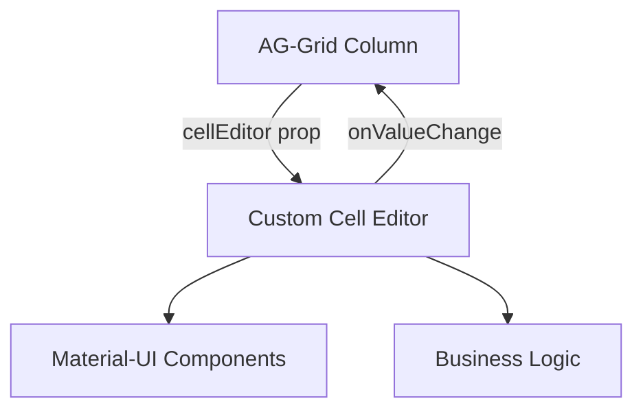

# Cell Editors Guide

## Overview

this application provides 13 custom cell editors built on top of AG-Grid's cell editor interface. Each editor is designed for specific data types and business logic, integrating seamlessly with Material-UI components for a consistent user experience.

**Location**: `src/frontend/cell-editors/`

## Architecture



## Common Interface

All cell editors implement the `CustomCellEditorProps` interface from ag-grid-react:

```typescript
interface CustomCellEditorProps<TData = any, TValue = any> {
  value: TValue;                    // Current cell value
  onValueChange: (value: TValue) => void;  // Callback to update value
  // Additional AG-Grid props available...
}
```

## Basic Editors

### 1. StringCellEditor

Text input with clear functionality.

**File**: `StringCellEditor.tsx`

**Props**:
```typescript
interface StringCellEditorProps extends CustomCellEditorProps<any, string | null> {
  value: string | null;
  allowNull?: boolean;  // Default: true
}
```

**Features**:
- Auto-focus on open
- Clear button (X icon)
- Null value support
- Material-UI Input component

**Usage**:
```typescript
{
  field: 'name',
  editable: true,
  cellEditor: StringCellEditor,
  cellEditorParams: {
    allowNull: true,
  },
}
```

**Implementation Highlights**:
```typescript
<Input
  className="px-1 text-[12px] flex-1"
  autoFocus
  disableUnderline
  value={value || ''}
  onChange={(e) => onValueChange(e.target.value || (allowNull ? null : ''))}
  onFocus={(e) => e.target.select()}
  endAdornment={
    <Close onClick={() => onValueChange(allowNull ? null : '')} />
  }
/>
```

---

### 2. NumericCellEditor

Number input with validation and null handling.

**File**: `NumericCellEditor.tsx`

**Props**:
```typescript
interface NumericCellEditorProps extends CustomCellEditorProps<any, number | null> {
  allowNull?: boolean;  // Default: false
}
```

**Features**:
- Numeric input validation (filters non-numeric characters)
- Supports negative numbers
- Supports decimals
- Auto-select text on focus
- Clear button

**Usage**:
```typescript
{
  field: 'amount',
  editable: true,
  cellEditor: NumericCellEditor,
  cellEditorParams: {
    allowNull: true,
  },
}
```

**Validation Logic**:
```typescript
onChange={(e) => {
  const cleaned = e.target.value.replace(/[^0-9-.]/g, '');
  const val = cleaned.length > 0 ? Number.parseFloat(cleaned) : null;
  onValueChange(allowNull ? val : val || 0);
}}
```

---

### 3. PercentCellEditor

Percentage input that stores values as decimals.

**File**: `PercentCellEditor.tsx`

**Features**:
- Displays as percentage (0-100)
- Stores as decimal (0-1)
- Automatic conversion
- Shows % symbol
- Clear button

**Usage**:
```typescript
{
  field: 'commission',
  editable: true,
  cellEditor: PercentCellEditor,
  valueFormatter: percentValueFormatter,
}
```

**Implementation**:
```typescript
const [inputValue, setInputValue] = useState(
  value ? (value * 100).toString() : ''
);

const onChange = (inputValue: string) => {
  const val = inputValue.length > 0 ? Number.parseFloat(inputValue) : null;
  const pct = val === null ? null : Math.max(0, val) / 100;
  onValueChange(pct);
};
```

**Display**: Input shows "25" for 0.25 value
**Storage**: Stores 0.25 in data model

---

### 4. DateCellEditor

Date picker using Material-UI DatePicker component.

**File**: `DateCellEditor.tsx`

**Features**:
- Material-UI DatePicker integration
- Calendar popup
- Formatted display (MMM DD, YYYY)
- UTC date handling
- Clear button

**Usage**:
```typescript
{
  field: 'releaseDate',
  editable: true,
  cellEditor: DateCellEditor,
  valueFormatter: dateValueFormatter,
}
```

**Implementation**:
```typescript
<DatePicker
  value={value ? dayjs.utc(value) : null}
  autoFocus
  format="MMM DD, YYYY"
  onChange={(date) => onValueChange(date ? date.toDate() : null)}
  slotProps={{
    textField: {
      variant: 'standard',
      InputProps: { className: 'text-[12px]', disableUnderline: true },
    },
  }}
/>
```

## Selection Editors

### 5. CurrencyCellEditor

Currency type selector.

**File**: `CurrencyCellEditor.tsx`

**Features**:
- Dropdown of all currency types
- Opens immediately (defaultOpen)
- Humanized currency names
- Material-UI Select component

**Usage**:
```typescript
{
  field: 'currency',
  editable: true,
  cellEditor: CurrencyCellEditor,
  valueFormatter: (params) => humanizeCurrencyType(params.value),
}
```

**Available Currencies**:
Uses Prisma's `CurrencyType` enum (USD, EUR, GBP, etc.)

```typescript
<Select
  defaultOpen
  value={value}
  onChange={(e) => onValueChange(e.target.value as CurrencyType)}
>
  {Object.values(CurrencyType).map((currency) => (
    <MenuItem value={currency}>
      {humanizeCurrencyType(currency)}
    </MenuItem>
  ))}
</Select>
```

---

### 6. SourceTypeCellEditor

Source type dropdown selector.

**File**: `SourceTypeCellEditor.tsx`

**Features**:
- All Prisma SourceType values
- Humanized display names
- Auto-open dropdown

**Usage**:
```typescript
{
  field: 'type',
  editable: true,
  cellEditor: SourceTypeCellEditor,
  valueFormatter: (params) => humanizeSourceType(params.value),
}
```

---

### 7. RightCellEditor

Rights type selector for copyright rights.

**File**: `RightCellEditor.tsx`

**Features**:
- Dropdown of all Rights values
- Humanized right names
- Auto-open on edit

**Usage**:
```typescript
{
  field: 'right',
  editable: true,
  cellEditor: RightCellEditor,
  valueFormatter: (params) => humanizeRight(params.value),
}
```

## Complex Editors

### 8. TagCellEditor

Multi-tag input with chip display.

**File**: `TagCellEditor.tsx`

**Features**:
- Add tags by pressing Enter
- Visual tag chips
- Delete individual tags
- Prevents duplicates
- Scrollable tag list

**Usage**:
```typescript
{
  field: 'tags',
  editable: true,
  cellEditor: TagCellEditor,
  cellRenderer: gridTagsCellRenderer,
  valueFormatter: (params) => params.value?.join(', ') || '',
  suppressKeyboardEvent: (params) => params.editing && params.event.key === 'Enter',
}
```

**Key Features**:
```typescript
const onKeyDown = (e: KeyboardEvent) => {
  if (e.key === 'Enter') {
    const tag = inputValue.trim();
    if (!!tag && !tags.includes(tag)) {
      onValueChange([...tags, tag]);
    }
    setInputValue('');
  }
};
```

**Note**: Use `suppressKeyboardEvent` to prevent Enter from closing the editor.

---

### 9. DurationCellEditor

Compound editor for period value and type.

**File**: `DurationCellEditor.tsx`

**Value Type**: `[number, SourcePeriodType]` tuple

**Features**:
- Numeric input for period
- Dropdown for type (Days/Months/Years)
- Side-by-side layout
- Clear button

**Usage**:
```typescript
{
  field: 'recoverablePeriod',
  editable: true,
  valueGetter: ({ data }) => [data.period, data.periodType],
  cellEditor: DurationCellEditor,
  cellEditorPopupPosition: 'under',
  cellRenderer: ({ data }) => (
    <GridCell>
      <Stack className="flex-row gap-1">
        <Typography>{data.period}</Typography>
        <Typography>{data.periodType}</Typography>
      </Stack>
    </GridCell>
  ),
}
```

**Storage**:
- First element: numeric period value
- Second element: `'Days' | 'Months' | 'Years'`

---

### 10. DealTypeCellEditor

Multi-select for deal types.

**File**: `DealTypeCellEditor.tsx`

**Value Type**: `DealType[]` array

**Features**:
- Multiple selection
- Checkbox interface
- Humanized deal type names
- Auto-open dropdown

**Usage**:
```typescript
{
  field: 'dealTypes',
  editable: true,
  cellEditor: DealTypeCellEditor,
  valueFormatter: (params) =>
    params.value?.map(humanizeDealType).join(', ') || '',
}
```

---

### 11. CurrencyFxRateCellEditor

Complex editor for currency exchange rates.

**File**: `CurrencyFxRateCellEditor.tsx`

**Value Type**: `CatalogFileCurrency[]` array

**Features**:
- Multiple currency/rate pairs
- Add/remove rows
- Currency dropdown
- FX rate input
- Integrated validation

**Usage**:
```typescript
{
  field: 'currencies',
  editable: true,
  cellEditor: CurrencyFxRateCellEditor,
  cellEditorPopup: true,
  cellEditorPopupPosition: 'under',
}
```

**Data Structure**:
```typescript
interface CatalogFileCurrency {
  id?: string;
  currency: CurrencyType;
  fxRate: number;
}
```

---

### 12. AdditionalFeesCellEditor

Most complex editor for managing additional fees.

**File**: `AdditionalFeesCellEditor.tsx`

**Value Type**: `CatalogFileFee[]` array

**Features**:
- Dynamic row addition/removal
- Fee name input
- Fee type selection (Flat $ or Percent %)
- Fee value input
- Currency-aware display
- Validation and constraints

**Usage**:
```typescript
{
  field: 'additionalFees',
  editable: true,
  cellEditor: AdditionalFeesCellEditor,
  cellEditorPopup: true,
  cellEditorPopupPosition: 'under',
}
```

**Data Structure**:
```typescript
interface CatalogFileFee {
  id?: string;
  name: string;
  type: 'Flat' | 'Percent';
  value: number;  // Dollar amount or decimal (0-1) for percent
}
```

**Validation**:
- Percent values clamped to 0-100% (stored as 0-1)
- Only rows with values are saved
- At least one row always present

**UI Layout**:
```
[+] [-] Name: [Input] [X]  Value: [$|%] [Input] [X]
[+] [-] Name: [Input] [X]  Value: [$|%] [Input] [X]
```

---

### 13. CatalogFileTransformationTemplateCellEditor

Template selector for file transformations.

**File**: `CatalogFileTransformationTemplateCellEditor.tsx`

**Features**:
- Dropdown of available templates
- Client-specific templates
- Auto-open selection

**Usage**:
```typescript
{
  field: 'templateId',
  editable: true,
  cellEditor: CatalogFileTransformationTemplateCellEditor,
}
```

## Usage Patterns

### Basic Column Configuration

```typescript
import { StringCellEditor } from '@/frontend';

const columnDefs = [
  {
    field: 'description',
    headerName: 'Description',
    editable: true,
    cellEditor: StringCellEditor,
  },
];
```

### With Cell Editor Params

```typescript
import { NumericCellEditor } from '@/frontend';

const columnDefs = [
  {
    field: 'quantity',
    editable: true,
    cellEditor: NumericCellEditor,
    cellEditorParams: {
      allowNull: false,  // Require a value
    },
  },
];
```

### Conditional Editing

```typescript
const columnDefs = [
  {
    field: 'amount',
    editable: (params) => params.data.status === 'draft',
    cellEditor: NumericCellEditor,
  },
];
```

### With Custom Rendering

```typescript
import { TagCellEditor, gridTagsCellRenderer } from '@/frontend';

const columnDefs = [
  {
    field: 'tags',
    editable: true,
    cellEditor: TagCellEditor,
    cellRenderer: gridTagsCellRenderer,  // Show tags as chips
    valueFormatter: (params) => params.value?.join(', ') || '',
  },
];
```

### Popup Editors

For complex editors, use popup mode:

```typescript
import { AdditionalFeesCellEditor } from '@/frontend';

const columnDefs = [
  {
    field: 'fees',
    editable: true,
    cellEditor: AdditionalFeesCellEditor,
    cellEditorPopup: true,
    cellEditorPopupPosition: 'under',  // or 'over'
  },
];
```

### With Value Getters/Setters

For compound values:

```typescript
import { DurationCellEditor } from '@/frontend';

const columnDefs = [
  {
    field: 'duration',
    editable: true,
    valueGetter: ({ data }) => [data.period, data.periodType],
    valueSetter: (params) => {
      params.data.period = params.newValue[0];
      params.data.periodType = params.newValue[1];
      return true;
    },
    cellEditor: DurationCellEditor,
  },
];
```

## Handling Cell Edits

### Using onCellEditRequest (Recommended)

```typescript
<CustomAgGrid
  id="my-grid"
  readOnlyEdit
  onCellEditRequest={({ api, data, column, newValue }) => {
    const field = column.getColId();

    // Update backend
    await updateRecord(data.id, { [field]: newValue });

    // Update local data
    data[field] = newValue;
    api.refreshCells({ rowNodes: [api.getRowNode(data.id)] });
  }}
  // ...
/>
```

### Using valueSetter

```typescript
const columnDefs = [
  {
    field: 'amount',
    editable: true,
    cellEditor: NumericCellEditor,
    valueSetter: (params) => {
      if (params.newValue !== params.oldValue) {
        params.data.amount = params.newValue;
        // Trigger side effects
        return true;  // Return true to refresh cell
      }
      return false;
    },
  },
];
```

## Keyboard Navigation

All editors support standard AG-Grid keyboard shortcuts:

- **Enter**: Start editing
- **Escape**: Cancel editing
- **Tab**: Commit and move to next cell
- **Shift+Tab**: Commit and move to previous cell

### Custom Keyboard Handling

For editors that need to capture keys (like TagCellEditor):

```typescript
{
  field: 'tags',
  cellEditor: TagCellEditor,
  suppressKeyboardEvent: (params) => {
    // Prevent Enter from closing editor when editing
    return params.editing && params.event.key === 'Enter';
  },
}
```

## Styling

All editors use consistent Material-UI styling:

```typescript
<Input
  className="px-1 text-[12px]"
  disableUnderline
  // ...
/>
```

### Custom Styles

Add custom classes to editor params:

```typescript
{
  field: 'name',
  cellEditor: StringCellEditor,
  cellClass: 'custom-cell-class',
}
```

## Validation

### Client-Side Validation

Implement in the editor:

```typescript
const onChange = (value: string) => {
  // Validate
  if (value.length > 100) {
    return; // Don't update if too long
  }
  onValueChange(value);
};
```

### Server-Side Validation

Implement in `onCellEditRequest`:

```typescript
onCellEditRequest={async ({ data, column, newValue, oldValue, api }) => {
  try {
    await updateRecord(data.id, { [column.getColId()]: newValue });
  } catch (error) {
    // Revert on error
    data[column.getColId()] = oldValue;
    api.refreshCells();
    showError(error.message);
  }
}}
```

## Best Practices

### 1. Use Appropriate Editor

- **Simple text**: `StringCellEditor`
- **Numbers**: `NumericCellEditor`
- **Percentages**: `PercentCellEditor`
- **Dates**: `DateCellEditor`
- **Enums**: Specific selector editors
- **Multiple values**: `TagCellEditor` or custom multi-editor
- **Complex objects**: Popup editors

### 2. Pair with Formatters

Always pair editors with appropriate value formatters:

```typescript
import { percentValueFormatter, PercentCellEditor } from '@/frontend';

{
  field: 'rate',
  cellEditor: PercentCellEditor,
  valueFormatter: percentValueFormatter,  // Display formatted
}
```

### 3. Handle Null Values

Decide if null is allowed:

```typescript
{
  field: 'optional',
  cellEditor: StringCellEditor,
  cellEditorParams: { allowNull: true },
}
```

### 4. Use Popup for Complex Editors

Large editors should use popup mode:

```typescript
{
  cellEditor: AdditionalFeesCellEditor,
  cellEditorPopup: true,
  cellEditorPopupPosition: 'under',
}
```

### 5. Optimize Performance

Memoize complex editor configurations:

```typescript
const columnDefs = useMemo(() => [
  {
    field: 'tags',
    cellEditor: TagCellEditor,
    // ...
  },
], [dependencies]);
```

## Creating Custom Editors

### Template

```typescript
import { Input, Stack } from '@mui/material';
import { useState } from 'react';
import type { CustomCellEditorProps } from 'ag-grid-react';

export function MyCustomEditor({ value, onValueChange }: CustomCellEditorProps<any, MyType>) {
  const [internalValue, setInternalValue] = useState(value);

  const handleChange = (newValue: MyType) => {
    setInternalValue(newValue);
    onValueChange(newValue);
  };

  return (
    <Stack className="flex-row items-center h-full w-full px-1">
      <Input
        autoFocus
        value={internalValue}
        onChange={(e) => handleChange(e.target.value)}
      />
    </Stack>
  );
}
```

### Guidelines

1. Use Material-UI components for consistency
2. Auto-focus the main input
3. Call `onValueChange` to update the grid
4. Handle null/undefined values
5. Add clear buttons for better UX
6. Use TypeScript for type safety
7. Add validation as needed

## Troubleshooting

### Editor Not Opening

- Check `editable: true` on column
- Verify user has edit permissions
- Check conditional editable function

### Value Not Updating

- Ensure `onValueChange` is called
- Check `valueSetter` returns true
- Verify `readOnlyEdit` is set for `onCellEditRequest`

### Editor Closes Immediately

- Add `suppressKeyboardEvent` for keys you want to handle
- Check for Tab/Enter key conflicts

### Styling Issues

- Ensure Material-UI theme is configured
- Check Tailwind CSS classes
- Verify component has proper height/width

## Related Documentation

### Core Documentation
- [CustomAgGrid Component](./rylty-ag-grid-component.md)
- [Grid Utilities](./grid-utilities.md)
- [Usage Examples](./usage-examples.md)
- [API Reference](./api-reference.md)

### Related Utilities
- **[String & Formatting](./utilities/string-formatting.md)** - toBase64, normalize, classList
- **[Date & Time](./utilities/date-time.md)** - Date formatting and validation
- **[Collection Utilities](./utilities/collections.md)** - distinct, nonEmptyItems for tag handling
- **[React Hooks](./utilities/hooks.md)** - useDebounce for editor interactions
- **[Utilities Overview](./utilities/README.md)** - Complete utilities index


