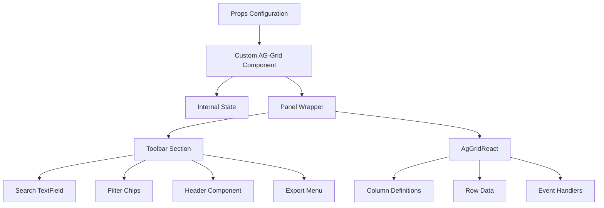

# Custom AG-Grid Component

## Overview

The custom AG-Grid wrapper component provides a consistent, feature-rich data grid interface across the application. It extends AG-Grid React with custom functionality including built-in search, filtering, export capabilities, and persistent user settings.

**Location**: `src/frontend/components/CustomAgGrid.tsx` (originally `CustomAgGrid.tsx`)

## Component Architecture



## Props Interface

### CustomAgGridProps

The component extends `AgGridReactProps` from ag-grid-react, inheriting all native AG-Grid props while adding custom properties:

```typescript
interface CustomAgGridProps extends AgGridReactProps {
  // Required
  id: string;                           // Unique grid identifier for settings persistence

  // Optional Custom Props
  theme?: string;                       // AG-Grid theme (default: 'quartz')
  loading?: boolean;                    // Show loading overlay
  withSearch?: boolean;                 // Enable search toolbar
  withExport?: boolean;                 // Enable export menu
  withCustomPlaceholder?: boolean;      // Use custom placeholder
  filters?: CustomAgGridFilter[];        // Filter chip definitions
  headerComponent?: ReactNode;          // Custom toolbar content
  exportFileName?: string;              // Default export filename
  processHeader?: (params) => string;   // Custom header processor for export
  customExports?: [string, () => Promise<void>][]; // Additional export options
  borderless?: boolean;                 // Remove panel border
  noRowsText?: string;                  // Custom empty state message
  searchClass?: string;                 // Custom search field className

  // Inherited from AgGridReactProps
  columnDefs?: ColDef[];
  rowData?: any[];
  defaultColDef?: ColDef;
  rowModelType?: 'clientSide' | 'serverSide';
  serverSideDatasource?: IServerSideDatasource;
  // ... and 200+ other AG-Grid props
}
```

## Key Features

### 1. Unique Grid Identification

Every grid must have a unique `id` prop:

```typescript
<CustomAgGrid
  id="catalog-songs"  // Used for settings persistence
  // ...
/>
```

**Purpose**:
- Persists column widths per grid
- Enables analytics tracking
- Identifies grid in settings storage

### 2. Built-in Search

Enable quick filtering across all columns:

```typescript
<CustomAgGrid
  id="my-grid"
  withSearch
  searchClass="custom-search"  // Optional styling
  rowData={data}
  columnDefs={columns}
/>
```

**Features**:
- Material-UI TextField integration
- Debounced search (immediate UI update)
- Clear button when text entered
- Analytics event tracking
- Works with client-side row model only

**Implementation**:
```typescript
const onSearchChange = (val: string) => {
  if (!!val) {
    trackEvent({ event: 'Grid Search Change', properties: { gridId, searchText: val } });
  }
  setSearchText(val);
  if (clientRowModel) {
    gridRef.current?.api.updateGridOptions({ quickFilterText: val });
  }
};
```

### 3. Filter Chips

Custom filtering with Material-UI chips:

```typescript
<CustomAgGrid
  id="documents"
  filters={[
    { label: 'All', selected: true },
    { label: 'Active', filterFn: (node) => node.data.active },
    { label: 'Archived', filterFn: (node) => node.data.archived },
  ]}
  rowData={data}
  columnDefs={columns}
/>
```

**Filter Interface**:
```typescript
interface CustomAgGridFilter {
  label: string;                        // Display text
  withCount?: boolean;                  // Show row count (default: true)
  selected?: boolean;                   // Initially selected
  filterFn?: (item: IRowNode) => boolean; // Filter logic
  fn?: (grid: AgGridReact) => void;     // Additional grid operations
}
```

**Features**:
- Automatic row count display
- Visual selection state
- External filter integration
- Analytics tracking
- Supports both client and server-side modes

### 4. Export Functionality

Built-in CSV and Excel export:

```typescript
<CustomAgGrid
  id="financial-report"
  withExport
  exportFileName="Financial Report"
  processHeader={({ column }) => column.getDefinition().headerName}
  customExports={[
    ['Custom Format', async () => {
      // Custom export logic
    }]
  ]}
  rowData={data}
  columnDefs={columns}
/>
```

**Export Options**:
- **CSV Export**: Client-side only rows
- **Excel Export**: Enterprise feature, supports all rows
- **Custom Exports**: Add your own export handlers
- **Header Processing**: Customize exported column headers

**Context Menu Integration**:
```typescript
const getContextMenuItems = useCallback(() => {
  return [
    'copy',
    'copyWithHeaders',
    'copyWithGroupHeaders',
    'separator',
    'export',
    {
      name: 'Export',
      subMenu: [
        {
          name: 'CSV (Client-Side Only)',
          action: () => exportCsv(),
        },
        {
          name: 'Excel (All Rows)',
          action: () => exportExcel(),
        },
        ...customExports.map(([name, fn]) => ({
          name,
          action: fn,
        })),
      ],
    },
  ];
}, [customExports, exportFileName, processHeader]);
```

### 5. Column Width Persistence

Automatically saves and restores column widths:

```typescript
// User resizes column
onColumnResized={({ finished, source, column }) => {
  if (finished && source === 'uiColumnResized') {
    const colId = column?.getColId() || '';
    const settings = { ...gridSettings };
    settings.columns = {
      ...settings.columns,
      [colId]: {
        width: column?.getActualWidth(),
      },
    };
    updateSetting({ [gridId]: settings });
  }
}}
```

**Storage**:
- Persisted via Settings API
- Per-user, per-grid
- Automatically applied on mount
- Works with column groups

### 6. Loading States

Professional loading experience:

```typescript
<CustomAgGrid
  id="my-grid"
  loading={isLoading}
  rowData={data}
  columnDefs={columns}
/>
```

**Loading Components**:
- **Row Loader**: Custom `BarLoadingIcon` for loading cells
- **Overlay Loader**: Full grid overlay when loading
- **Empty State**: Custom message when no data

```typescript
loadingCellRenderer={() => (
  <GridCell align="center">
    <BarLoadingIcon bars={4} />
  </GridCell>
)}

loadingOverlayComponent={() =>
  loading && <BarLoadingIcon size="large" bars={7} />
}

noRowsOverlayComponent={() =>
  <Typography className="font-bold">{noRowsText}</Typography>
}
```

### 7. Default Column Configuration

Sensible defaults for all columns:

```typescript
defaultColDef={{
  resizable: true,        // All columns resizable
  filter: true,           // All columns filterable
  sortable: true,         // All columns sortable
  cellDataType: false,    // Disable auto data type detection
  filterParams: {
    buttons: ['reset'],   // Show reset button in filters
  },
  // Merged with user-provided defaultColDef
}}
```

**Override Example**:
```typescript
<CustomAgGrid
  id="my-grid"
  defaultColDef={{
    filter: false,  // Disable filtering for this grid
    minWidth: 100,  // Set minimum column width
  }}
  // ...
/>
```

### 8. Custom Toolbar Content

Add custom components to the toolbar:

```typescript
<CustomAgGrid
  id="catalog-documents"
  withSearch
  filters={filters}
  headerComponent={
    <>
      <Typography>Last updated: {lastUpdated}</Typography>
      <Button onClick={handleRefresh}>Refresh</Button>
    </>
  }
  rowData={data}
  columnDefs={columns}
/>
```

**Layout**:
```
[Search] [Filter Chips] [Header Component] [Export Button]
```

### 9. Theme Support

Multiple theme options:

```typescript
// Default theme (quartz)
<CustomAgGrid id="grid1" rowData={data} columnDefs={columns} />

// Custom theme
<CustomAgGrid id="grid2" theme="notifications" rowData={data} columnDefs={columns} />

// Borderless
<CustomAgGrid id="grid3" borderless rowData={data} columnDefs={columns} />
```

**Available Themes**:
- `quartz` (default) - Main application theme
- `notifications` - For notification lists
- `alerts` - For alert displays

## Usage Patterns

### Basic Client-Side Grid

```typescript
import { CustomAgGrid } from '@/frontend';

function MyComponent() {
  const rowData = [
    { id: 1, name: 'Item 1', value: 100 },
    { id: 2, name: 'Item 2', value: 200 },
  ];

  const columnDefs = [
    { field: 'name', headerName: 'Name' },
    { field: 'value', headerName: 'Value', type: 'numericColumn' },
  ];

  return (
    <CustomAgGrid
      id="basic-grid"
      rowData={rowData}
      columnDefs={columnDefs}
      withSearch
    />
  );
}
```

### Server-Side Grid

```typescript
import { CustomAgGrid } from '@/frontend';
import { useRef } from 'react';

function PerformanceGrid() {
  const gridRef = useRef<CustomAgGridRef>(null);
  const { datasource } = useServerSideDatasource();

  return (
    <CustomAgGrid
      id="performance-grid"
      ref={gridRef}
      rowModelType="serverSide"
      serverSideDatasource={datasource}
      columnDefs={columnDefs}
      withExport
    />
  );
}
```

### Editable Grid

```typescript
import { CustomAgGrid, TagCellEditor, NumericCellEditor } from '@/frontend';

function EditableGrid() {
  const handleCellEdit = (event: CellEditRequestEvent) => {
    const { data, column, newValue } = event;
    // Update backend
    updateRecord(data.id, column.getColId(), newValue);
  };

  const columnDefs = [
    {
      field: 'name',
      editable: true,
      cellEditor: 'agTextCellEditor',
    },
    {
      field: 'tags',
      editable: true,
      cellEditor: TagCellEditor,
    },
    {
      field: 'amount',
      editable: true,
      cellEditor: NumericCellEditor,
    },
  ];

  return (
    <CustomAgGrid
      id="editable-grid"
      rowData={data}
      columnDefs={columnDefs}
      onCellEditRequest={handleCellEdit}
      readOnlyEdit  // Use read-only edit mode
    />
  );
}
```

### Grid with Filters and Export

```typescript
function DocumentsGrid() {
  return (
    <CustomAgGrid
      id="documents"
      rowData={documents}
      columnDefs={columnDefs}
      withSearch
      withExport
      exportFileName="Documents Report"
      filters={[
        { label: 'All', selected: true },
        {
          label: 'Statements',
          filterFn: (node) => node.data.type === 'Statement'
        },
        {
          label: 'Agreements',
          filterFn: (node) => node.data.type === 'Agreement'
        },
      ]}
      headerComponent={
        <Button onClick={handleUpload}>Upload Document</Button>
      }
    />
  );
}
```

## Ref API

The component exposes a ref with useful methods:

```typescript
interface CustomAgGridRef<T = any> {
  grid: AgGridReact<T> | null;  // Access underlying AG-Grid instance
  resetGrid: () => void;         // Reset filters and sorting
}
```

**Usage**:
```typescript
const gridRef = useRef<CustomAgGridRef>(null);

// Access grid API
gridRef.current?.grid?.api.deselectAll();

// Reset grid state
gridRef.current?.resetGrid();

<CustomAgGrid
  ref={gridRef}
  id="my-grid"
  // ...
/>
```

## Event Handlers

Common event handlers you can use:

### onGridReady

Called when grid is initialized:

```typescript
<CustomAgGrid
  id="my-grid"
  onGridReady={(event) => {
    console.log('Grid ready:', event.api);
    event.api.sizeColumnsToFit();
  }}
  // ...
/>
```

### onCellEditRequest

For handling cell edits (recommended over onCellValueChanged):

```typescript
<CustomAgGrid
  id="my-grid"
  onCellEditRequest={({ api, data, column, newValue }) => {
    // Update your data source
    updateData(data.id, column.getColId(), newValue);
  }}
  readOnlyEdit  // Use with readOnlyEdit mode
  // ...
/>
```

### onRowDataUpdated

Called when row data changes:

```typescript
<CustomAgGrid
  id="my-grid"
  onRowDataUpdated={(event) => {
    // Recalculate totals, update UI, etc.
    calculateTotals(event.api);
  }}
  // ...
/>
```

### onFilterChanged

Called when filters are applied:

```typescript
<CustomAgGrid
  id="my-grid"
  onFilterChanged={(event) => {
    const displayedRows = [];
    event.api.forEachNodeAfterFilter(node => displayedRows.push(node.data));
    console.log('Filtered rows:', displayedRows);
  }}
  // ...
/>
```

## Advanced Features

### Custom Context Menu

The component provides a default context menu with copy and export options. All native AG-Grid context menu items are still available.

### Row Selection

Enable row selection:

```typescript
<CustomAgGrid
  id="my-grid"
  rowSelection="multiple"
  suppressRowClickSelection  // Only select via checkbox
  columnDefs={[
    {
      field: 'name',
      checkboxSelection: true,
      headerCheckboxSelection: true,
      headerCheckboxSelectionFilteredOnly: true,
    },
    // ... other columns
  ]}
  // ...
/>
```

### Range Selection

Enable Excel-like range selection:

```typescript
<CustomAgGrid
  id="my-grid"
  enableRangeSelection
  // ...
/>
```

### Row Grouping

For hierarchical data display:

```typescript
<CustomAgGrid
  id="my-grid"
  rowGroupPanelShow="always"
  groupDisplayType="custom"
  autoGroupColumnDef={{
    pinned: 'left',
    cellRendererParams: {
      suppressCount: true,
    },
  }}
  // ...
/>
```

## Styling

### Panel Wrapper

The grid is wrapped in a `Panel` component:

```typescript
<Panel
  borderless={borderless}
  className={`flex-1 overflow-hidden ag-theme-${theme || 'quartz'} ${className}`}
>
  {/* Toolbar and Grid */}
</Panel>
```

### Custom CSS Classes

Add custom classes via the `className` prop:

```typescript
<CustomAgGrid
  id="my-grid"
  className="h-full w-full custom-grid"
  // ...
/>
```

### Cell Styling

Use AG-Grid's built-in styling props:

```typescript
columnDefs={[
  {
    field: 'status',
    cellClass: 'font-bold',
    cellStyle: { backgroundColor: '#f0f0f0' },
  },
]}
```

## Performance Tips

1. **Memoize Column Definitions**:
```typescript
const columnDefs = useMemo(() => [
  { field: 'name', headerName: 'Name' },
  // ...
], [dependencies]);
```

2. **Use getRowId**:
```typescript
<CustomAgGrid
  id="my-grid"
  getRowId={(params) => params.data.id}
  // Helps AG-Grid identify rows for efficient updates
/>
```

3. **Optimize Value Getters**:
```typescript
// Good - simple and fast
{ field: 'name' }

// Avoid if possible - computed on every render
{ valueGetter: (params) => params.data.firstName + ' ' + params.data.lastName }
```

4. **Server-Side for Large Datasets**:
Use server-side row model for > 1000 rows

## Common Patterns

### Pinned Rows for Totals

```typescript
const calculateTotals = (api) => {
  let total = 0;
  api.forEachNode(node => total += node.data.value);
  api.updateGridOptions({
    pinnedTopRowData: [{ name: 'Total', value: total }]
  });
};

<CustomAgGrid
  id="my-grid"
  onRowDataUpdated={(e) => calculateTotals(e.api)}
  // ...
/>
```

### Conditional Editing

```typescript
const columnDefs = [
  {
    field: 'name',
    editable: (params) => params.data.status === 'draft',
  },
];
```

### Dynamic Column Definitions

```typescript
const columns = useMemo(() => {
  const baseCols = [{ field: 'name' }];

  if (showAdvanced) {
    baseCols.push({ field: 'details' });
  }

  return baseCols;
}, [showAdvanced]);
```

## Troubleshooting

### Grid Not Displaying

- Check that parent container has defined height
- Verify `rowData` or `serverSideDatasource` is provided
- Ensure theme CSS is imported

### Columns Not Resizing

- Check that `resizable: true` in column def
- Verify column widths are not hard-coded

### Search Not Working

- Only works with `rowModelType="clientSide"`
- Ensure `withSearch` prop is set
- Check that columns have data to search

### Export Issues

- Excel export requires Enterprise license
- Ensure `exportFileName` is provided
- Check `processHeader` function if custom headers needed

## Related Documentation

- [Cell Editors Guide](./cell-editors.md)
- [Grid Utilities](./grid-utilities.md)
- [Usage Examples](./usage-examples.md)
- [API Reference](./api-reference.md)

