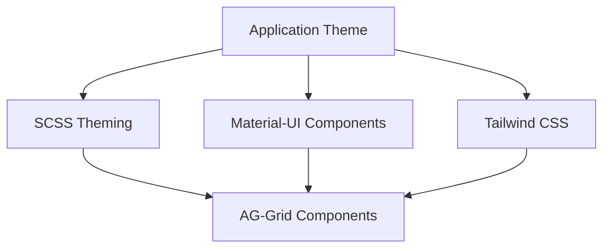

# Design System Integration

## Overview

This AG-Grid implementation seamlessly integrates with the application's design system, combining AG-Grid's theming capabilities with Material-UI components and Tailwind CSS utility classes to create a cohesive, professional user interface.

_Originally developed for SUDS Culture._

## Design System Stack



## AG-Grid Theming

### Primary Theme: ag-theme-quartz

The main grid theme is based on AG-Grid's Quartz theme with extensive customization.

**Location**: `src/styles/globals.scss`

```scss
.ag-theme-quartz {
  // Color System
  --ag-active-color: black;
  --ag-header-background-color: #fcfcfc;
  --ag-header-foreground-color: #808187;
  --ag-secondary-foreground-color: #808187;
  --ag-subheader-background-color: #fcfcfc;
  --ag-background-color: #ffffff;
  --ag-odd-row-background-color: transparent;
  --ag-row-hover-color: #fafafa;
  --ag-border-color: #e5e7eb;

  // Selection Colors
  --ag-selected-row-background-color: #eae7f3;
  --ag-range-selection-background-color: #d6cee6;
  --ag-range-selection-background-color-1: #d6cee6;
  --ag-range-selection-border-color: transparent;

  // Typography
  --ag-font-size: 12px;
  --ag-font-family: 'Open Sans';

  // Layout
  --ag-cell-horizontal-padding: 12px;
  --ag-row-border-width: 0px;
  --ag-wrapper-border-radius: 0px;

  // Borders
  --ag-borders: none;
  --ag-borders-critical: 1px solid;
  --ag-borders-secondary: 1px solid;

  // Other
  --ag-input-focus-box-shadow: none;
  --ag-chip-border-color: transparent;
  --ag-modal-overlay-background-color: transparent;
}
```

### Color Palette

**Primary Colors**:
- Purple: `#320E83` - Active elements, checkboxes
- Light Purple: `#eae7f3` - Selected rows
- Medium Purple: `#d6cee6` - Range selection

**Neutral Colors**:
- White: `#ffffff` - Background
- Light Gray: `#fcfcfc` - Headers
- Medium Gray: `#808187` - Secondary text
- Border Gray: `#e5e7eb` - Borders
- Hover Gray: `#fafafa` - Row hover

**Status Colors**:
- Success Green: `#4DA155` - Positive values, processed
- Success Background: `#E6F8DC`
- Error Red: `#C1686F` - Errors, negative values
- Error Background: `#FDF1E5`
- Warning Orange: `#DA6C4A`

### Custom Cell Wrapper Styles

```scss
.ag-cell-wrapper {
  height: 100%;

  &.ag-row-group {
    align-items: center;
  }
}
```

### Selection Checkbox

```scss
.ag-selection-checkbox {
  cursor: pointer;
}
```

### Header and Status Bar

```scss
.ag-column-drop,
.ag-status-bar,
.ag-header {
  border-top: 1px solid #e5e7eb;
}
```

### Additional Themes

#### ag-theme-notifications

Optimized for notification lists:

```scss
.ag-theme-notifications {
  --ag-background-color: #fff;
  --ag-borders: none;
  --ag-modal-overlay-background-color: transparent;
  --ag-row-height: 100px;
  --ag-cell-horizontal-padding: 0px;
  --ag-row-border-width: 0px;
}
```

**Usage**:
```typescript
<CustomAgGrid
  id="notifications"
  theme="notifications"
  rowData={notifications}
  // ...
/>
```

#### ag-theme-alerts

Optimized for alert displays:

```scss
.ag-theme-alerts {
  --ag-background-color: #fff;
  --ag-borders: none;
  --ag-modal-overlay-background-color: transparent;
  --ag-cell-horizontal-padding: 0px;
  --ag-row-border-width: 0px;
}
```

**Usage**:
```typescript
<CustomAgGrid
  id="alerts"
  theme="alerts"
  rowData={alerts}
  // ...
/>
```

## Material-UI Integration

### Component Usage

All custom components use Material-UI for consistency:

#### Typography

```typescript
import { Typography } from '@mui/material';

<Typography className="text-[12px] font-bold">
  Header Text
</Typography>
```

#### TextField (Search)

```typescript
import { TextField, InputAdornment } from '@mui/material';

<TextField
  size="small"
  placeholder="Search"
  value={searchText}
  onChange={(e) => onSearchChange(e.target.value)}
  InputProps={{
    className: 'text-[0.875rem]',
    startAdornment: (
      <InputAdornment position="start">
        <SearchIcon />
      </InputAdornment>
    ),
  }}
/>
```

#### Chips (Filters)

```typescript
import { Chip } from '@mui/material';

<Chip
  label={filterLabel}
  color={selected ? 'primary' : 'default'}
  variant={selected ? 'filled' : 'outlined'}
  onClick={handleFilterClick}
/>
```

#### Buttons

```typescript
import { Button } from '@mui/material';

<Button
  variant="contained"
  onClick={handleExport}
>
  Export
</Button>
```

#### Select (Cell Editors)

```typescript
import { Select, MenuItem, Input } from '@mui/material';

<Select
  value={value}
  onChange={handleChange}
  input={<Input />}
  defaultOpen
  size="small"
>
  <MenuItem value="option1">Option 1</MenuItem>
  <MenuItem value="option2">Option 2</MenuItem>
</Select>
```

#### DatePicker

```typescript
import { DatePicker } from '@mui/x-date-pickers';

<DatePicker
  value={date}
  onChange={handleDateChange}
  format="MMM DD, YYYY"
  slotProps={{
    textField: {
      variant: 'standard',
      InputProps: {
        className: 'text-[12px]',
        disableUnderline: true,
      },
    },
  }}
/>
```

#### Icons

```typescript
import { Close, Download, Add, Remove, Refresh, Warning } from '@mui/icons-material';

<Close className="cursor-pointer text-[16px]" onClick={handleClose} />
<Download className="text-[14px]" />
<Refresh className="text-[14px] text-[#320E83] animate-spin" />
```

### Material-UI Theme

The application uses a custom Material-UI theme (configured in `src/styles/theme.tsx`):

```typescript
import { createTheme } from '@mui/material/styles';

const theme = createTheme({
  palette: {
    primary: {
      main: '#320E83',
    },
    // ... other colors
  },
  typography: {
    fontFamily: 'Open Sans',
    fontSize: 12,
  },
});
```

## Tailwind CSS Integration

### Utility Classes

Tailwind CSS is heavily used for layout and styling:

#### Layout

```typescript
// Flexbox
className="flex flex-row items-center justify-between gap-2"
className="flex flex-col flex-1 min-h-0"

// Grid
className="grid grid-cols-3 gap-4"

// Spacing
className="p-3 px-4 py-2 mx-auto"
className="gap-1 gap-2 space-x-2"
```

#### Sizing

```typescript
// Width/Height
className="w-full h-full w-[14.5rem] h-[40px]"
className="min-w-0 min-h-0 max-w-none"

// Flex
className="flex-1 flex-auto flex-shrink-0"
```

#### Typography

```typescript
// Size
className="text-[12px] text-[0.875rem] text-sm"

// Weight
className="font-bold font-normal"

// Color
className="text-[#808187] text-red-600 text-black"
```

#### Backgrounds & Borders

```typescript
// Background
className="bg-white bg-[#fcfcfc] bg-transparent"

// Border
className="border border-solid border-[#e5e7eb] rounded-2xl"

// Border Radius
className="rounded rounded-full rounded-2xl"
```

#### Positioning

```typescript
// Position
className="relative absolute fixed"

// Pinning
className="sticky top-0 left-0 right-0"

// Z-index
className="z-10 z-50"
```

#### Visibility & Display

```typescript
// Display
className="hidden block inline-block"

// Overflow
className="overflow-hidden overflow-auto overflow-scroll"

// Cursor
className="cursor-pointer cursor-not-allowed"
```

### Common Component Patterns

#### GridCell with Tailwind

```typescript
<Stack className="h-full w-full min-w-0 min-h-0 flex-row items-center justify-start gap-1">
  {children}
</Stack>
```

#### Panel Wrapper

```typescript
<Stack className={`
  bg-white
  rounded-2xl
  border border-solid border-[#E5E7EB]
  ${className}
`}>
  {children}
</Stack>
```

#### Cell Editor Input

```typescript
<Input
  className="px-1 text-[12px] flex-1 max-w-none"
  inputProps={{ className: 'text-right mr-1' }}
  disableUnderline
  autoFocus
  // ...
/>
```

## Panel Component

The grid wrapper component that provides consistent styling:

**Location**: `src/frontend/components/Panel.tsx`

```typescript
interface PanelProps {
  className?: string;
  children?: ReactNode;
  borderless?: boolean;
}

export function Panel({ className = '', children, borderless = false }: PanelProps) {
  return (
    <Stack className={`
      bg-white
      ${!borderless ? 'rounded-2xl border border-solid border-[#E5E7EB]' : ''}
      ${className}
    `}>
      {children}
    </Stack>
  );
}
```

**Usage**:
```typescript
// With border (default)
<Panel className="flex-1 overflow-hidden">
  <AgGridReact />
</Panel>

// Borderless
<Panel borderless className="h-full">
  <AgGridReact />
</Panel>
```

## Custom Icons

### CheckIcon

Custom check mark icon used throughout:

```typescript
export function CheckIcon({ className = '' }: { className?: string }) {
  return (
    <svg
      className={className}
      width="10"
      height="8"
      viewBox="0 0 10 8"
      fill="none"
    >
      <path d="M1 4L3.5 6.5L9 1" stroke="currentColor" strokeWidth="2" />
    </svg>
  );
}
```

### SearchIcon

Custom search icon for toolbar:

```typescript
export function SearchIcon() {
  return (
    <svg width="16" height="16" viewBox="0 0 16 16">
      {/* SVG path */}
    </svg>
  );
}
```

## Loading Components

### BarLoadingIcon

Animated loading indicator:

```typescript
interface BarLoadingIconProps {
  size?: 'small' | 'medium' | 'large';
  bars?: number;
}

export function BarLoadingIcon({ size = 'medium', bars = 4 }: BarLoadingIconProps) {
  const height = size === 'small' ? 'h-8' : size === 'large' ? 'h-16' : 'h-12';

  return (
    <Stack className={`flex-row gap-1 ${height}`}>
      {Array.from({ length: bars }).map((_, i) => (
        <Box key={i} className="bar-loading bg-[#320E83]" />
      ))}
    </Stack>
  );
}
```

**Animation** (in `globals.scss`):
```scss
@keyframes music-bar {
  10% { height: 30%; }
  30% { height: 100%; }
  60% { height: 50%; }
  80% { height: 75%; }
  100% { height: 60%; }
}

.bar-loading {
  height: 100%;
  flex: 1 0%;
  animation: music-bar 2.2s ease infinite alternate;
  border-radius: 10px;

  &:nth-of-type(2) { animation-delay: -2.2s; }
  &:nth-of-type(3) { animation-delay: -3.7s; }
  &:nth-of-type(4) { animation-delay: -1.4s; }
  &:nth-of-type(5) { animation-delay: -2.8s; }
  &:nth-of-type(6) { animation-delay: -4.1s; }
  &:nth-of-type(7) { animation-delay: -0.3s; }
}
```

## Responsive Design

### Breakpoints

Use Tailwind's responsive classes:

```typescript
className="
  w-full
  md:w-1/2
  lg:w-1/3
  xl:w-1/4
"
```

### Grid Responsiveness

AG-Grid automatically handles column resizing and virtualization.

## Dark Mode Support

While not currently implemented, the design system is structured to support dark mode:

```scss
// Future dark mode support
.dark .ag-theme-quartz {
  --ag-background-color: #1a1a1a;
  --ag-header-background-color: #2a2a2a;
  --ag-foreground-color: #ffffff;
  // ... other dark mode variables
}
```

## Accessibility

### Color Contrast

All colors meet WCAG AA standards:
- Text on backgrounds: minimum 4.5:1 ratio
- Interactive elements: minimum 3:1 ratio

### Focus States

```scss
.ag-theme-quartz {
  --ag-input-focus-box-shadow: 0 0 0 2px rgba(50, 14, 131, 0.2);
}
```

### Keyboard Navigation

- All interactive elements are keyboard accessible
- Custom focus management in cell editors
- Skip links for screen readers

### ARIA Labels

```typescript
<Button aria-label="Export data to CSV">
  <Download />
</Button>

<TextField
  aria-label="Search grid data"
  placeholder="Search"
/>
```

## Custom Styling Examples

### Conditional Row Styling

```typescript
const getRowClass = (params: RowClassParams) => {
  if (params.data.status === 'error') {
    return 'bg-red-50';
  }
  if (params.data.highlighted) {
    return 'bg-yellow-50 font-bold';
  }
  return '';
};

<CustomAgGrid
  id="my-grid"
  getRowClass={getRowClass}
  // ...
/>
```

### Column-Specific Styling

```typescript
const columnDefs = [
  {
    field: 'status',
    cellClass: 'font-bold text-center',
    cellStyle: (params) => {
      if (params.value === 'active') {
        return { backgroundColor: '#E6F8DC' };
      }
      return null;
    },
  },
];
```

### Pinned Row Styling

```typescript
// In globals.scss
.ag-theme-quartz .ag-row-pinned {
  font-weight: bold;
  background-color: #fcfcfc;
  border-top: 2px solid #320E83;
}
```

## Best Practices

### 1. Use Design Tokens

Reference CSS variables instead of hard-coded values:

```typescript
// Good
className="text-[var(--ag-secondary-foreground-color)]"

// Avoid
className="text-[#808187]"
```

### 2. Consistent Spacing

Use Tailwind's spacing scale:

```typescript
// Good
className="p-3 gap-2 mx-4"

// Avoid
className="p-[13px] gap-[9px] mx-[17px]"
```

### 3. Component Composition

Build complex UIs by composing simple components:

```typescript
<GridCell row className="gap-2">
  <Typography className="text-[12px]">Label:</Typography>
  <Chip size="small" label="Value" />
</GridCell>
```

### 4. Theme Consistency

Always use the same theme across related grids:

```typescript
// All financial grids use default theme
<CustomAgGrid id="financials-1" />
<CustomAgGrid id="financials-2" />

// Notifications use custom theme
<CustomAgGrid id="notifications" theme="notifications" />
```

### 5. Performance

- Avoid inline styles when possible
- Use CSS classes for repeated styles
- Memoize complex style calculations

## Related Documentation

### Core Documentation
- [CustomAgGrid Component](./rylty-ag-grid-component.md)
- [Cell Editors Guide](./cell-editors.md)
- [Grid Utilities](./grid-utilities.md)
- [Usage Examples](./usage-examples.md)

### Utilities
- **[Reusable Components](./utilities/components.md)** - Panel, BarLoadingIcon, CheckIcon, SearchIcon
- **[String & Formatting](./utilities/string-formatting.md)** - classList for conditional styling
- **[React Hooks](./utilities/hooks.md)** - useSetting for theme preferences
- **[Utilities Overview](./utilities/README.md)** - Complete utilities index


