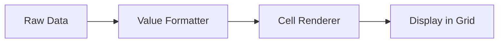

# Grid Utilities and Formatters

## Overview

The grid utilities module provides a comprehensive set of value formatters, cell renderers, and helper functions that ensure consistent data display across all grids in the application.

**Location**: `src/frontend/utils/gridUtil.tsx`

## Architecture



## Value Formatters

Value formatters transform raw data into human-readable strings for display in grid cells.

### Currency Formatters

#### currencyValueFormatter

Formats numeric values as currency with locale support.

**Signature**:
```typescript
function currencyValueFormatter<T = any>(
  currency?: CurrencyType
): (params: ValueFormatterParams<T>) => string
```

**Usage**:
```typescript
import { currencyValueFormatter } from '@/frontend';

const columnDefs = [
  {
    field: 'amount',
    headerName: 'Amount',
    valueFormatter: currencyValueFormatter('USD'),
    type: 'numericColumn',
  },
];
```

**Features**:
- Locale-aware formatting (en-US)
- Currency symbol inclusion
- Configurable currency type
- Handles near-zero values (rounds -0.005 to 0.005 to 0)
- Shows "—" for null/undefined when row data exists

**Example Output**:
```
1000.50  → "$1,000.50"
0.001    → "$0.00"
null     → "—"
```

**Implementation**:
```typescript
const getCurrencyFormatter = (currency: CurrencyType = 'USD') =>
  new Intl.NumberFormat('en-US', {
    style: 'currency',
    currency,
  });

export function currencyValueFormatter<T = any>(currency?: CurrencyType) {
  const currencyFormatter = getCurrencyFormatter(currency);

  return ({ value, data }: ValueFormatterParams<T>) =>
    typeof value === 'number'
      ? currencyFormatter.format(value > -0.005 && value < 0.005 ? 0 : value)
      : data ? '—' : undefined;
}
```

---

#### clientCurrencyValueFormatter

Formats currency using the currency type from the client data model.

**Signature**:
```typescript
function clientCurrencyValueFormatter(
  params: ValueFormatterParams<Client>
): string
```

**Usage**:
```typescript
const columnDefs = [
  {
    field: 'balance',
    valueFormatter: clientCurrencyValueFormatter,
  },
];
```

**Note**: Requires row data to have a `currencyType` property.

---

#### negativeCurrencyValueFormatter

Formats currency values as negative (useful for fees/expenses).

**Signature**:
```typescript
function negativeCurrencyValueFormatter<T = any>(
  currency?: CurrencyType
): (params: ValueFormatterParams<T>) => string
```

**Usage**:
```typescript
const columnDefs = [
  {
    field: 'fee',
    valueFormatter: negativeCurrencyValueFormatter('USD'),
  },
];
```

**Example Output**:
```
100.00  → "-$100.00"
-50.00  → "$50.00"
```

---

### Percentage Formatter

#### percentValueFormatter

Formats decimal values as percentages.

**Signature**:
```typescript
function percentValueFormatter<T>(
  params: ValueFormatterParams<T>
): string
```

**Usage**:
```typescript
const columnDefs = [
  {
    field: 'commission',
    valueFormatter: percentValueFormatter,
  },
];
```

**Features**:
- Converts decimal to percentage
- Shows 2 decimal places
- Handles near-zero values
- Shows "—" for null/undefined

**Example Output**:
```
0.25    → "25.00%"
0.5     → "50.00%"
0.0001  → "0.00%"
null    → "—"
```

**Implementation**:
```typescript
const percentFormatter = new Intl.NumberFormat('en-US', {
  style: 'percent',
  minimumFractionDigits: 2,
});

export function percentValueFormatter<T>({ value }: ValueFormatterParams<T>) {
  return typeof value === 'number'
    ? percentFormatter.format(value > -0.00005 && value < 0.00005 ? 0 : value)
    : '—';
}
```

---

### Number Formatter

#### numberValueFormatter

Formats numbers with thousand separators.

**Signature**:
```typescript
function numberValueFormatter<T>(
  params: ValueFormatterParams<T>
): string
```

**Usage**:
```typescript
const columnDefs = [
  {
    field: 'quantity',
    valueFormatter: numberValueFormatter,
  },
];
```

**Example Output**:
```
1000     → "1,000"
1000000  → "1,000,000"
0.001    → "0"
null     → "—"
```

---

### Date Formatters

#### dateValueFormatter

Formats dates in a readable format.

**Signature**:
```typescript
function dateValueFormatter<T>(
  params: ValueFormatterParams<T>
): string
```

**Usage**:
```typescript
const columnDefs = [
  {
    field: 'releaseDate',
    valueFormatter: dateValueFormatter,
  },
];
```

**Features**:
- UTC date handling
- Format: "MMM DD, YYYY"
- Validates date before formatting
- Shows "—" for invalid/null dates

**Example Output**:
```
"2024-01-15"  → "Jan 15, 2024"
null          → "—"
invalid       → "—"
```

**Implementation**:
```typescript
export function dateValueFormatter<T>({ value, data }: ValueFormatterParams<T>) {
  const date = dayjs.utc(value);
  return value && date.isValid()
    ? date.format('MMM DD, YYYY')
    : data ? '—' : undefined;
}
```

---

#### dateTimeValueFormatter

Formats dates with time.

**Signature**:
```typescript
function dateTimeValueFormatter<T>(
  params: ValueFormatterParams<T>
): string
```

**Usage**:
```typescript
const columnDefs = [
  {
    field: 'updatedAt',
    valueFormatter: dateTimeValueFormatter,
  },
];
```

**Features**:
- Local time (not UTC)
- Format: "MMM DD, YYYY   hh:mm A"
- 12-hour format with AM/PM

**Example Output**:
```
"2024-01-15T14:30:00"  → "Jan 15, 2024   02:30 PM"
```

---

### Empty Value Formatter

#### emptyValueFormatter

Shows "—" for empty/null values, passes through existing values.

**Signature**:
```typescript
function emptyValueFormatter<T>(
  params: ValueFormatterParams<T>
): string
```

**Usage**:
```typescript
const columnDefs = [
  {
    field: 'notes',
    valueFormatter: emptyValueFormatter,
  },
];
```

**Example Output**:
```
"Some text"  → "Some text"
""           → "—"
null         → "—"
undefined    → "—"
```

---

## Cell Renderers

Cell renderers provide custom React components for complex cell content.

### GridCell Component

Base component for cell content with alignment and layout support.

**Signature**:
```typescript
interface GridCellProps {
  align?: 'right' | 'center' | 'left';
  row?: boolean;
  children: ReactNode;
  className?: string;
  title?: string;
}

function GridCell(props: GridCellProps): JSX.Element
```

**Usage**:
```typescript
import { GridCell } from '@/frontend';

const cellRenderer = (params) => (
  <GridCell align="right" title="Tooltip text">
    <Typography>${params.value}</Typography>
  </GridCell>
);
```

**Features**:
- Flexbox layout (column or row)
- Alignment control
- Full height/width
- Tooltip support
- Consistent spacing

**Implementation**:
```typescript
export const GridCell = ({
  children,
  className = '',
  title,
  align = 'left',
  row = false
}: GridCellProps) => {
  const vertical = row ? 'flex-row items-center' : 'justify-center';
  const horizontal = row
    ? align === 'right' ? 'justify-end' : align === 'center' ? 'justify-center' : 'justify-start'
    : align === 'right' ? 'items-end' : align === 'center' ? 'items-center' : 'items-start';

  return (
    <Stack className={`h-full w-full min-w-0 min-h-0 ${vertical} ${horizontal} ${className}`} title={title}>
      {children}
    </Stack>
  );
};
```

---

### gridTagsCellRenderer

Renders array of tags as Material-UI chips.

**Signature**:
```typescript
function gridTagsCellRenderer<T>(
  params: ICellRendererParams<T, string[]>
): JSX.Element
```

**Usage**:
```typescript
const columnDefs = [
  {
    field: 'tags',
    cellRenderer: gridTagsCellRenderer,
  },
];
```

**Example Display**:
```
["Rock", "Pop", "80s"] → [Rock] [Pop] [80s]
```

**Implementation**:
```typescript
export function gridTagsCellRenderer<T>({ value }: ICellRendererParams<T, string[]>) {
  return (
    <GridCell row className="gap-1">
      {value?.map((tag, i) => (
        <Tag key={i} tag={tag} viewOnly />
      ))}
    </GridCell>
  );
}
```

---

### gridBooleanCellRenderer

Renders boolean values as checkmarks.

**Signature**:
```typescript
function gridBooleanCellRenderer<T>(
  params: ICellRendererParams<T, boolean>
): JSX.Element
```

**Usage**:
```typescript
const columnDefs = [
  {
    field: 'isActive',
    cellRenderer: gridBooleanCellRenderer,
  },
];
```

**Display**:
- `true` → ✓ (checkmark icon)
- `false` → (empty)

**Implementation**:
```typescript
export function gridBooleanCellRenderer<T>(params: ICellRendererParams<T, boolean>) {
  return params.value ? (
    <GridCell align="center">
      <CheckIcon className="fill-[#320E83]" />
    </GridCell>
  ) : (
    <></>
  );
}
```

---

### gridValueColorCellRenderer

Color-codes numeric values (green for positive, red for negative).

**Signature**:
```typescript
function gridValueColorCellRenderer<T>(
  params: ICellRendererParams<T, number>
): JSX.Element
```

**Usage**:
```typescript
const columnDefs = [
  {
    field: 'change',
    valueFormatter: percentValueFormatter,
    cellRenderer: gridValueColorCellRenderer,
  },
];
```

**Color Scheme**:
- Positive (> 0.005): Green background (#E6F8DC), green text (#4DA155)
- Negative (< -0.005): Orange background (#FDF1E5), red text (#DA6C4A)
- Near zero: No styling

**Implementation**:
```typescript
export function gridValueColorCellRenderer<T>({ value, valueFormatted }: ICellRendererParams<T, number>) {
  return (
    <GridCell align="right">
      <Typography
        variant="body2"
        className={
          'p-[2px] text-[12px] w-fit ' +
          (typeof value === 'number'
            ? value > 0.005
              ? 'bg-[#E6F8DC] text-[#4DA155]'
              : value < -0.005
              ? 'bg-[#FDF1E5] text-[#DA6C4A]'
              : ''
            : '')
        }
      >
        {valueFormatted}
      </Typography>
    </GridCell>
  );
}
```

---

### catalogFileStatusCellRenderer

Renders file processing status with icons.

**Signature**:
```typescript
function catalogFileStatusCellRenderer<T>(
  params: ICellRendererParams<T, CatalogFileStatus>
): JSX.Element
```

**Usage**:
```typescript
const columnDefs = [
  {
    field: 'status',
    cellRenderer: catalogFileStatusCellRenderer,
  },
];
```

**Status Display**:
- `Processed` → ✓ "Processed" (green check)
- `Saved` → ↻ "Processing" (spinning refresh)
- `ReUploading` → ↻ "Reuploading" (spinning refresh)
- `Error` → ⚠ "Error" (warning icon, red text)

**Implementation**:
```typescript
export function catalogFileStatusCellRenderer<T>({ value }: ICellRendererParams<T, CatalogFileStatus>) {
  return (
    <GridCell row className="gap-1">
      {value === CatalogFileStatus.Processed && (
        <Box className="w-[0.875rem] h-[0.875rem] rounded-full bg-[#320E83] flex items-center justify-center">
          <CheckIcon className="fill-white h-[0.375rem]" />
        </Box>
      )}
      {(value === CatalogFileStatus.Saved || value === CatalogFileStatus.ReUploading) && (
        <Refresh className="text-[14px] text-[#320E83] animate-spin" />
      )}
      {value === CatalogFileStatus.Error && <Warning className="text-[14px] text-[#C1686F]" />}
      <Typography className={`text-[12px] ${value === CatalogFileStatus.Error ? 'text-[#C1686F]' : 'text-[#000000]'}`}>
        {value}
      </Typography>
    </GridCell>
  );
}
```

---

### catalogReportStatusCellRenderer

Similar to file status, for report generation status.

**Signature**:
```typescript
function catalogReportStatusCellRenderer<T>(
  params: ICellRendererParams<T, CatalogReportStatus>
): JSX.Element
```

**Usage**:
```typescript
const columnDefs = [
  {
    field: 'reportStatus',
    cellRenderer: catalogReportStatusCellRenderer,
  },
];
```

---

## Helper Functions

### Row Comparison Utilities

#### isPreviousRowEqual

Checks if the previous row has the same value for a field.

**Signature**:
```typescript
function isPreviousRowEqual(
  params: BaseColDefOptionalDataParams<any> | RowClassParams<any>,
  field: string,
  ignoreEmpty?: boolean
): boolean
```

**Usage**:
```typescript
const columnDefs = [
  {
    field: 'category',
    cellClass: (params) =>
      isPreviousRowEqual(params, 'category') ? 'hide-duplicate' : '',
  },
];
```

**Parameters**:
- `params` - AG-Grid params object
- `field` - Field name to compare
- `ignoreEmpty` - Don't match if value is empty (default: true)

---

#### isNextRowEqual

Checks if the next row has the same value for a field.

**Signature**:
```typescript
function isNextRowEqual(
  params: BaseColDefOptionalDataParams<any> | RowClassParams<any>,
  field: string,
  ignoreEmpty?: boolean
): boolean
```

**Usage**:
```typescript
const getRowClass = (params: RowClassParams) => {
  if (!isNextRowEqual(params, 'groupId')) {
    return 'group-last-row';
  }
  return '';
};
```

---

### percentFilterValueGetter

Helper for filtering percentage columns by the display value.

**Signature**:
```typescript
function percentFilterValueGetter<TData, TValue>(
  params: ValueGetterParams<TData, TValue>
): number | null
```

**Usage**:
```typescript
const columnDefs = [
  {
    field: 'rate',
    valueFormatter: percentValueFormatter,
    filterValueGetter: percentFilterValueGetter,
    // Now filter operates on 0-100 scale instead of 0-1
  },
];
```

**Purpose**: Allows users to filter by "25" instead of "0.25" when percentages are displayed.

---

## Usage Patterns

### Complete Column Example

```typescript
import {
  currencyValueFormatter,
  percentValueFormatter,
  dateValueFormatter,
  gridTagsCellRenderer,
  NumericCellEditor,
} from '@/frontend';

const columnDefs = [
  {
    field: 'name',
    headerName: 'Song Name',
    pinned: 'left',
  },
  {
    field: 'amount',
    headerName: 'Amount',
    type: 'numericColumn',
    valueFormatter: currencyValueFormatter('USD'),
    editable: true,
    cellEditor: NumericCellEditor,
  },
  {
    field: 'rate',
    headerName: 'Rate',
    type: 'numericColumn',
    valueFormatter: percentValueFormatter,
    filterValueGetter: percentFilterValueGetter,
  },
  {
    field: 'releaseDate',
    headerName: 'Release Date',
    valueFormatter: dateValueFormatter,
  },
  {
    field: 'tags',
    headerName: 'Tags',
    cellRenderer: gridTagsCellRenderer,
  },
];
```

---

### Custom Cell Renderer

```typescript
import { GridCell } from '@/frontend';
import { Typography, Chip } from '@mui/material';

const customRenderer = (params: ICellRendererParams) => {
  const status = params.value;

  return (
    <GridCell row className="gap-2">
      <Chip
        label={status}
        color={status === 'active' ? 'success' : 'default'}
        size="small"
      />
      <Typography className="text-[12px]">
        {params.data.description}
      </Typography>
    </GridCell>
  );
};

const columnDefs = [
  {
    field: 'status',
    cellRenderer: customRenderer,
  },
];
```

---

### Conditional Formatting

```typescript
import { currencyValueFormatter, GridCell } from '@/frontend';
import { Typography } from '@mui/material';

const conditionalRenderer = (params: ICellRendererParams<any, number>) => {
  const formatter = currencyValueFormatter('USD');
  const formatted = formatter(params);
  const isNegative = params.value < 0;

  return (
    <GridCell align="right">
      <Typography
        className={`text-[12px] ${isNegative ? 'text-red-600 font-bold' : ''}`}
      >
        {formatted}
      </Typography>
    </GridCell>
  );
};
```

---

## Best Practices

### 1. Pair Formatters with Editors

Always use matching formatters and editors:

```typescript
{
  field: 'rate',
  valueFormatter: percentValueFormatter,
  cellEditor: PercentCellEditor,
}
```

### 2. Use Type-Safe Formatters

Provide generic types for better type checking:

```typescript
const formatter = currencyValueFormatter<MyDataType>('USD');
```

### 3. Handle Null Values Consistently

All formatters show "—" for null/undefined values when row data exists.

### 4. Optimize Performance

Memoize custom renderers:

```typescript
const customRenderer = useCallback((params: ICellRendererParams) => {
  // Renderer logic
}, [dependencies]);
```

### 5. Use GridCell for Consistency

Wrap custom cell content in GridCell:

```typescript
const myRenderer = (params) => (
  <GridCell align="center">
    <MyCustomComponent data={params.data} />
  </GridCell>
);
```

---

## Internationalization

### Currency Formatting

All currency formatters use `Intl.NumberFormat` with 'en-US' locale:

```typescript
const formatter = new Intl.NumberFormat('en-US', {
  style: 'currency',
  currency: 'USD',
});
```

### Date Formatting

Uses dayjs with customizable formats:

```typescript
dayjs(value).format('MMM DD, YYYY');
```

---

## Troubleshooting

### Formatter Not Applied

- Check column definition has `valueFormatter` property
- Verify formatter is imported correctly
- Ensure formatter returns a string

### Renderer Not Displaying

- Check `cellRenderer` property is set
- Verify renderer returns valid JSX
- Check for console errors

### "—" Showing for Valid Values

- Verify value type matches formatter expectation
- Check for NaN or invalid values
- Ensure data is not undefined

### Performance Issues

- Avoid complex calculations in formatters
- Memoize renderer functions
- Use simpler formatters when possible

---

## Related Documentation

### Core Documentation
- [CustomAgGrid Component](./rylty-ag-grid-component.md)
- [Cell Editors Guide](./cell-editors.md)
- [Usage Examples](./usage-examples.md)
- [API Reference](./api-reference.md)

### Related Utilities
- **[Date & Time](./utilities/date-time.md)** - humanizeDateTime, date formatting patterns
- **[String & Formatting](./utilities/string-formatting.md)** - emDash, toTitleCase, classList
- **[Collection Utilities](./utilities/collections.md)** - distinct, nonEmptyItems, sum
- **[Reusable Components](./utilities/components.md)** - GridCell, CheckIcon, BarLoadingIcon
- **[Utilities Overview](./utilities/README.md)** - Complete utilities index

