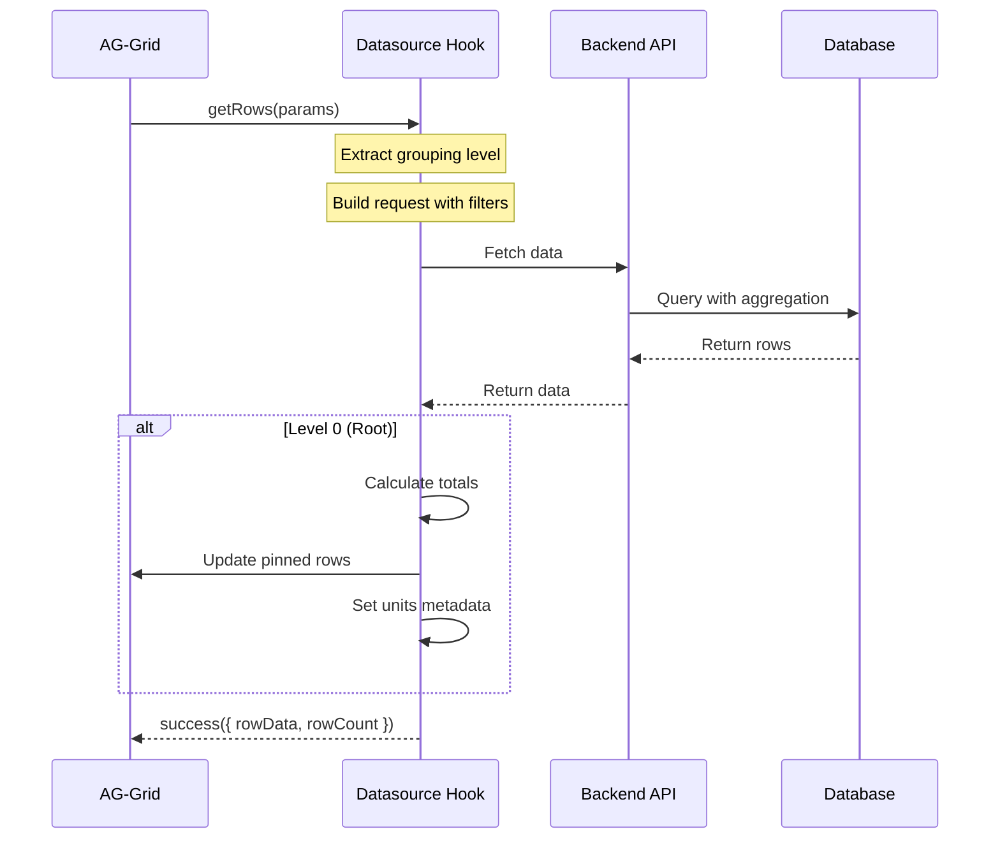

# Server-Side Datasource Integration

## Overview

The server-side row model is a powerful feature that enables AG-Grid to handle large datasets by loading data on-demand from the backend. This implementation demonstrates a sophisticated server-side datasource pattern for performance data with support for hierarchical grouping, sorting, and filtering.

**Location**: `src/frontend/utils/serverSideDatasourceUtil.ts` (example implementation)

## When to Use Server-Side vs Client-Side

### Client-Side Row Model

**Best for**:
- Small to medium datasets (< 1,000 rows)
- All data can be loaded at once
- Fast filtering and sorting is critical
- No hierarchical grouping needed

**Advantages**:
- Instant sorting and filtering
- Simple implementation
- All grid features available
- No network latency

**Example**:
```typescript
<CustomAgGrid
  id="simple-grid"
  rowData={allData}  // All data loaded
  rowModelType="clientSide"  // Default
  columnDefs={columnDefs}
/>
```

### Server-Side Row Model

**Best for**:
- Large datasets (> 1,000 rows)
- Hierarchical/grouped data
- Data that needs server-side aggregation
- Reducing initial load time

**Advantages**:
- Minimal memory usage
- Scalable to millions of rows
- Server-side aggregation and filtering
- Lazy loading of groups

**Example**:
```typescript
<CustomAgGrid
  id="performance-grid"
  serverSideDatasource={datasource}
  rowModelType="serverSide"
  columnDefs={columnDefs}
/>
```

## Architecture



## IServerSideDatasource Interface

AG-Grid's server-side datasource requires implementing the `IServerSideDatasource` interface:

```typescript
interface IServerSideDatasource {
  getRows(params: IServerSideGetRowsParams): void;
  destroy?(): void;
}

interface IServerSideGetRowsParams {
  request: IServerSideGetRowsRequest;
  parentNode: IRowNode;
  success(params: { rowData: any[]; rowCount?: number }): void;
  fail(): void;
}
```

## Financial Performance Datasource Hook

### useServerSideDatasource

The primary hook for creating server-side datasources in this application.

**Signature**:
```typescript
interface FinancialPerformanceDatasourceParams {
  selectedFilters: Dictionary<string>;
  gridRef: RefObject<CustomAgGridRef<any>>;
  catalogSourceIdFilter?: string;
}

function useServerSideDatasource(
  params: FinancialPerformanceDatasourceParams
): {
  datasource: IServerSideDatasource;
  units: FinancialPerformanceUnitYear[];
  lastUpdated: Date | null;
}
```

**Usage**:
```typescript
import { useServerSideDatasource } from '@/frontend';

function PerformanceGrid() {
  const gridRef = useRef<CustomAgGridRef>(null);
  const [selectedFilters, setSelectedFilters] = useState({
    group: 'catalogId, sourceId',
    periodType: 'quarter',
    dateType: 'statementDate',
    valueType: 'earnings',
  });

  const { datasource, units, lastUpdated } = useServerSideDatasource({
    selectedFilters,
    gridRef,
  });

  return (
    <CustomAgGrid
      id="performance"
      ref={gridRef}
      rowModelType="serverSide"
      serverSideDatasource={datasource}
      columnDefs={generateColumns(units)}
    />
  );
}
```

## Implementation Details

### 1. Building the Request

The datasource builds a hierarchical request based on the grouping level:

```typescript
const getRows = async (params) => {
  const selectedGroups = selectedFilters['group'].split(', ');
  const level = params.parentNode.level + 1;

  let req: FinancialPerformanceRequest = {
    group: selectedGroups.at(level),  // Current level group
    sort: JSON.stringify(params.request.sortModel),
    clientId: clientId,
    periodType: selectedFilters['periodType'],
    dateType: selectedFilters['dateType'],
    valueType: selectedFilters['valueType'],
  };

  // Add parent group IDs for filtering
  const ids: string[] = [];
  let parent: IRowNode | null = params.parentNode;
  while (parent?.data) {
    ids.push(parent.data.id);
    parent = parent.parent;
  }
  ids.reverse();

  selectedGroups.slice(0, Math.max(0, level)).forEach((g, i) => {
    req[g] = ids[i];
  });

  const { data } = await getFinancialPerformance(req);
  // ...
};
```

### 2. Hierarchical Grouping

The datasource supports multiple levels of grouping:

**Example Hierarchy**:
```
Catalog A
  ├─ Source 1
  │   ├─ Song X (leaf)
  │   └─ Song Y (leaf)
  └─ Source 2
      ├─ Song Z (leaf)
      └─ Song W (leaf)
```

**Configuration**:
```typescript
const selectedGroups = ['catalogId', 'sourceId', 'songId'];

// Level 0: Groups by catalogId
// Level 1: Groups by sourceId (within selected catalog)
// Level 2: Groups by songId (within selected source) - leaf nodes
```

### 3. Root Level Processing

At level 0, additional processing occurs:

```typescript
if (level === 0) {
  // Get units metadata (years, quarters, months)
  if (data.units) {
    setUnits(data.units);
  }

  // Get last updated timestamp
  if (data.lastUpdated) {
    setLastUpdated(data.lastUpdated);
  }

  // Calculate and show totals row
  if (data.items.length) {
    const total = calculateTotals(data.items, data.units);
    gridRef.current?.grid?.api.updateGridOptions({
      pinnedTopRowData: [total]
    });
  } else {
    gridRef.current?.grid?.api.showNoRowsOverlay();
  }
}
```

### 4. Totals Calculation

Automatic calculation of totals for pinned top row:

```typescript
const total: Dictionary<string | number | null> = {
  id: 'total',
  group: 'Total',
  total: null,
  percent: 1,
};

data.items.forEach((item) => {
  data.units?.forEach((unit) => {
    if (unit.units) {
      // Quarterly or monthly data
      unit.units.forEach((subUnit) => {
        const key = `${unit.year} ${subUnit}`;
        const val = item[key];
        if (typeof val === 'number') {
          total[key] = (total[key] || 0) + val;
        }
      });
    } else {
      // Yearly data
      const key = unit.year;
      const val = item[key];
      if (typeof val === 'number') {
        total[key] = (total[key] || 0) + val;
      }
    }
  });

  if (typeof item.total === 'number') {
    total.total = (total.total || 0) + item.total;
  }
});

gridRef.current?.grid?.api.updateGridOptions({
  pinnedTopRowData: [total]
});
```

### 5. Success/Failure Handling

Always call `success()` or `fail()` on the params:

```typescript
if (data) {
  params.success({
    rowData: data.items,
    rowCount: data.items.length
  });
} else {
  params.fail();
}
```

## Dynamic Column Generation

Generate columns based on the units returned from the API:

```typescript
const columns = useMemo(() => {
  const cols: ColDef[] = [
    {
      colId: 'group',
      field: 'group',
      headerName: 'Group',
      pinned: 'left',
      showRowGroup: true,
      cellRenderer: 'agGroupCellRenderer',
    },
  ];

  // Add columns for each unit (year/quarter/month)
  units?.forEach((year) => {
    if (year.units) {
      // Quarterly or monthly columns
      cols.push({
        headerName: year.year.toString(),
        children: year.units.map((unit) => ({
          colId: `${year.year}-${unit}`,
          headerName: unit,
          type: 'numericColumn',
          valueFormatter: currencyValueFormatter('USD'),
          valueGetter: ({ data }) => data?.[`${year.year} ${unit}`],
        })),
      });
    } else {
      // Yearly column
      cols.push({
        colId: year.year.toString(),
        headerName: year.year.toString(),
        type: 'numericColumn',
        valueFormatter: currencyValueFormatter('USD'),
        valueGetter: ({ data }) => data?.[year.year],
      });
    }
  });

  // Add total column
  cols.push({
    colId: 'total',
    headerName: 'Total',
    pinned: 'right',
    type: 'numericColumn',
    valueFormatter: currencyValueFormatter('USD'),
    valueGetter: ({ data }) => data?.total,
  });

  return cols;
}, [units]);
```

## Row Identification

Proper row IDs are critical for hierarchical data:

```typescript
<CustomAgGrid
  id="performance"
  rowModelType="serverSide"
  serverSideDatasource={datasource}
  getRowId={(params: GetRowIdParams) =>
    [...(params.parentKeys || []), params.data.id]?.join('|')
  }
  // Generates IDs like: "catalog1", "catalog1|source1", "catalog1|source1|song1"
/>
```

## Grid Configuration for Server-Side

```typescript
<CustomAgGrid
  id="performance"
  ref={gridRef}
  rowModelType="serverSide"
  serverSideDatasource={datasource}
  columnDefs={columns}

  // Grouping configuration
  groupDisplayType="custom"
  autoGroupColumnDef={{
    pinned: 'left',
    cellRendererParams: {
      suppressCount: true,
    },
  }}

  // Row identification
  getRowId={(params) =>
    [...(params.parentKeys || []), params.data.id]?.join('|')
  }

  // Sorting
  defaultColDef={{
    sortable: true,
    filter: false,  // Server-side filtering not implemented
  }}

  // Additional options
  suppressRowClickSelection
  animateRows={false}  // Better performance for server-side
/>
```

## Filter Integration

### Updating the Datasource

When filters change, the datasource automatically updates:

```typescript
const { datasource } = useServerSideDatasource({
  selectedFilters,  // Changes trigger datasource recreation
  gridRef,
});

useEffect(() => {
  // Datasource changed, refresh grid
  gridRef.current?.grid?.api.refreshServerSide({ purge: true });
}, [datasource]);
```

### Filter State Management

```typescript
const [selectedFilters, setSelectedFilters] = useState({
  group: 'catalogId, sourceId',
  periodType: 'quarter',
  dateType: 'statementDate',
  valueType: 'earnings',
});

const updateFilter = (key: string, value: string) => {
  setSelectedFilters(prev => ({
    ...prev,
    [key]: value,
  }));
};

// Filter UI
<Select value={selectedFilters.periodType} onChange={(e) => updateFilter('periodType', e.target.value)}>
  <MenuItem value="quarter">Quarterly</MenuItem>
  <MenuItem value="month">Monthly</MenuItem>
  <MenuItem value="year">Yearly</MenuItem>
</Select>
```

## Performance Optimization

### 1. Memoize the Datasource

The hook uses `useMemo` to prevent unnecessary recreation:

```typescript
const datasource = useMemo<IServerSideDatasource>(
  () => ({
    getRows: async (params) => {
      // Implementation
    },
  }),
  [selectedFilters, catalogSourceId, clientId, getFinancialPerformance, gridRef]
);
```

### 2. Lazy API Queries

Use RTK Query's lazy query for on-demand fetching:

```typescript
const [getFinancialPerformance] = useLazyGetFinancialPerformanceQuery();

// Only fetches when getRows is called
const { data } = await getFinancialPerformance(req);
```

### 3. Efficient State Updates

Only update state at level 0:

```typescript
if (level === 0) {
  setUnits(data.units);
  setLastUpdated(data.lastUpdated);
}
```

### 4. Purge Cache on Filter Change

Clear cached data when filters change:

```typescript
useEffect(() => {
  if (selectedFilters.periodType !== periodType) {
    setUnits([]);
    setPeriodType(selectedFilters.periodType);
    gridRef.current?.grid?.api.refreshServerSide({ purge: true });
  }
}, [selectedFilters.periodType]);
```

## Error Handling

```typescript
try {
  const { data, error } = await getFinancialPerformance(req);

  if (error) {
    console.error('Failed to fetch data:', error);
    params.fail();
    return;
  }

  if (data) {
    params.success({ rowData: data.items, rowCount: data.items.length });
  } else {
    params.fail();
  }
} catch (err) {
  console.error('Unexpected error:', err);
  params.fail();
}
```

## Loading States

Show loading overlay while fetching:

```typescript
<CustomAgGrid
  id="performance"
  loading={isLoading}  // Shows overlay
  serverSideDatasource={datasource}
  loadingOverlayComponent={() => <BarLoadingIcon size="large" bars={7} />}
  // ...
/>
```

## Creating Custom Datasources

### Basic Template

```typescript
import { useMemo } from 'react';
import type { IServerSideDatasource } from 'ag-grid-community';

export function useMyDatasource(filters: any) {
  const datasource = useMemo<IServerSideDatasource>(
    () => ({
      getRows: async (params) => {
        try {
          // 1. Extract parameters
          const level = params.parentNode.level + 1;
          const sortModel = params.request.sortModel;
          const filterModel = params.request.filterModel;

          // 2. Build API request
          const request = {
            ...filters,
            sort: JSON.stringify(sortModel),
            filter: JSON.stringify(filterModel),
          };

          // 3. Fetch data
          const response = await fetch('/api/data', {
            method: 'POST',
            body: JSON.stringify(request),
          });
          const data = await response.json();

          // 4. Return success
          params.success({
            rowData: data.items,
            rowCount: data.total,
          });
        } catch (error) {
          console.error(error);
          params.fail();
        }
      },
    }),
    [filters]
  );

  return datasource;
}
```

### With Grouping Support

```typescript
export function useGroupedDatasource(groups: string[]) {
  const datasource = useMemo<IServerSideDatasource>(
    () => ({
      getRows: async (params) => {
        const level = params.parentNode.level + 1;
        const currentGroup = groups[level];

        // Build parent filters
        const parentIds: Record<string, string> = {};
        let parent = params.parentNode;
        for (let i = level - 1; i >= 0; i--) {
          if (parent?.data) {
            parentIds[groups[i]] = parent.data.id;
            parent = parent.parent;
          }
        }

        // Fetch data for current level
        const data = await fetchGroupedData({
          group: currentGroup,
          parentIds,
          sort: params.request.sortModel,
        });

        params.success({
          rowData: data.items,
          rowCount: data.items.length,
        });
      },
    }),
    [groups]
  );

  return datasource;
}
```

## Best Practices

### 1. Always Provide Row IDs

```typescript
getRowId={(params) => {
  // For flat data
  return params.data.id;

  // For hierarchical data
  return [...(params.parentKeys || []), params.data.id].join('|');
}}
```

### 2. Handle Empty States

```typescript
if (data.items.length === 0) {
  gridRef.current?.grid?.api.showNoRowsOverlay();
} else {
  gridRef.current?.grid?.api.hideOverlay();
}
```

### 3. Memoize Dependencies

```typescript
const datasource = useMemo(() => ({
  getRows: async (params) => {
    // Use latest filter values
  },
}), [filters, otherDeps]);  // Only recreate when deps change
```

### 4. Use Lazy Queries

```typescript
const [fetchData] = useLazyFetchDataQuery();

// Instead of triggering on mount
const { data } = useFetchDataQuery(params);
```

### 5. Clear Cache Appropriately

```typescript
// Full purge (refetch everything)
api.refreshServerSide({ purge: true });

// Partial refresh (keep cached data)
api.refreshServerSide({ purge: false });

// Refresh specific groups
api.refreshServerSide({
  route: ['catalog1', 'source1'],
  purge: true,
});
```

## Troubleshooting

### Data Not Loading

- Check `params.success()` is called with valid data
- Verify API endpoint is returning data
- Check network tab for failed requests
- Ensure row IDs are unique

### Infinite Loading

- Make sure `params.success()` or `params.fail()` is always called
- Check for errors in the console
- Verify the datasource isn't recreated on every render

### Groups Not Expanding

- Check `getRowId` includes parent keys
- Verify child rows have unique IDs
- Ensure `rowCount` is provided in success callback

### Sorting Not Working

- Pass `sortModel` to backend
- Return sorted data from API
- Verify column definitions have `sortable: true`

## Related Documentation

### Core Documentation
- [CustomAgGrid Component](./rylty-ag-grid-component.md)
- [Usage Examples](./usage-examples.md)
- [API Reference](./api-reference.md)
- [AG-Grid Server-Side Row Model](https://www.ag-grid.com/react-data-grid/server-side-model/)

### Related Utilities
- **[Collection Utilities](./utilities/collections.md)** - distinct, sum for data aggregation
- **[React Hooks](./utilities/hooks.md)** - Custom hooks patterns for datasource management
- **[Utilities Overview](./utilities/README.md)** - Complete utilities index


